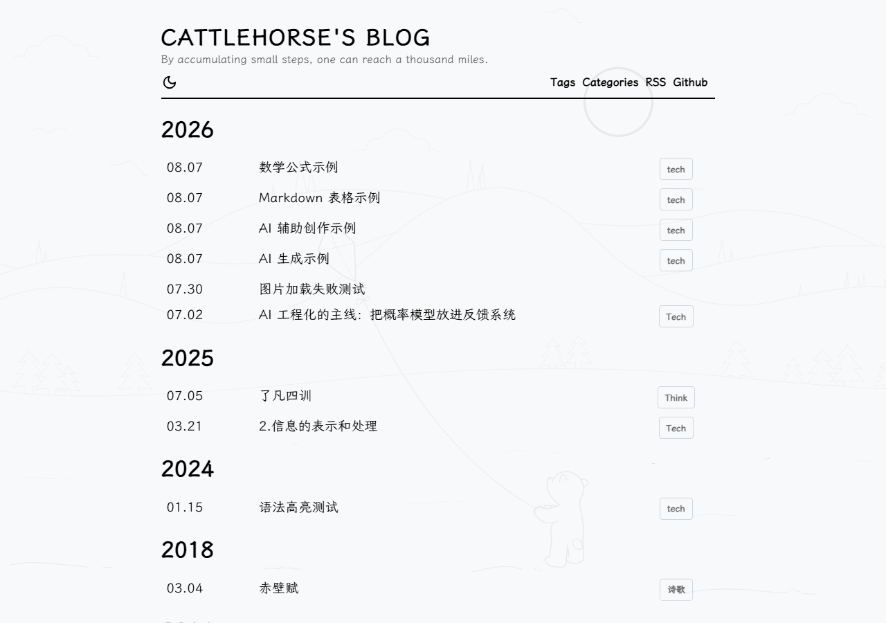
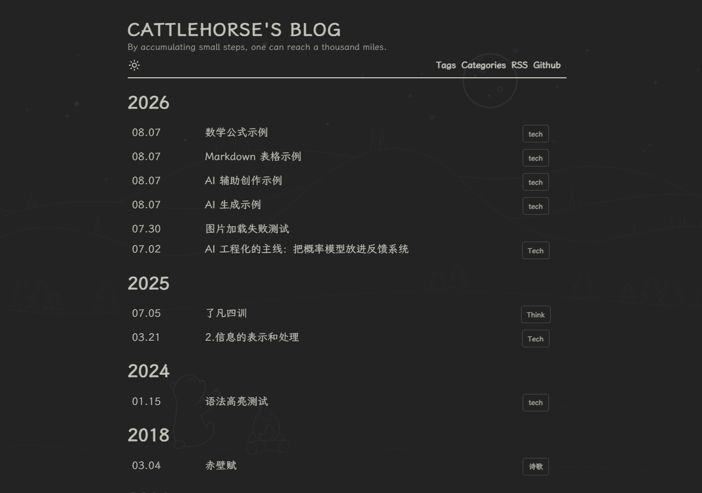

# YinYang

一个极简的 Hugo 博客主题，fork 自 [joway/hugo-theme-yinyang](https://github.com/joway/hugo-theme-yinyang)，并在此基础上做了大量增强。

**在线演示**：[https://cattle0horse.github.io/](https://cattle0horse.github.io/)





## 与原版 yinyang 相比

除了继承原版的极简布局，这个 fork 新增了以下能力：

| 功能 | 说明 |
|---|---|
| 🌓 亮暗主题切换 | 一键在亮色 / 暗色间切换，跟随系统偏好，无闪屏（FOUC） |
| 📐 数学公式 | 构建期服务端渲染 KaTeX，页面加载零 JS、零跳变 |
| 💻 代码块工具栏 | 语言标签、一键复制、超长代码自动折叠 |
| 🖼 图片增强 | 原生懒加载、骨架屏占位、加载失败重试 |
| 📑 文章目录 | 宽屏侧边栏 / 窄屏浮层，滚动自动高亮当前位置 |
| 📌 脚注跳转 | 点击跳转脚注，返回引用处并脉冲高亮 |
| 🗂 Gallery 图库 | 专门的内容类型，两列网格展示图片 |
| ⚡ 文章操作区 | 复制 Markdown、查看 Raw、编辑原文纠错 |
| 🤖 AI 创作标注 | frontmatter 声明创作方式，标题下方低调标注 |

## 安装

在站点根目录执行：

```shell
git submodule add https://github.com/Cattle0Horse/hugo-theme-yinyang.git themes/yinyang
```

修改 `config.toml`：

```toml
theme = "yinyang"
```

## 本地预览

在仓库根目录启动示例站点：

```shell
hugo server -s exampleSite --themesDir ../.. --theme $(basename $(pwd))
```

浏览器打开 `http://localhost:1313` 即可预览主题效果。

## 配置

### 标题

```toml
[params]
headTitle = "CattleHorse"
```

如果不设置 `headTitle`，则使用 `.Site.Params.author.name`。

### 主要内容分区

```toml
[params]
mainSections = ["posts"]
```

### 字体

本主题使用**系统字体栈**——无需 CDN、无需下载、无 FOFT。浏览器自动为每个平台选择最佳字体：

| 用途 | 字体栈 |
|---|---|
| 正文 | `-apple-system, BlinkMacSystemFont, "Segoe UI", Roboto, "Noto Sans", ...` |
| 代码 | `"SF Mono", "Fira Code", Menlo, Monaco, "Courier New", ...` |

如需使用自定义字体，通过 `extraHead` 注入 CDN 并覆盖优先级。以下以霞鹜文楷（正文）+
Fira Code（代码）为例：

```toml
[params]
extraHead = '''
  <link rel="stylesheet" href="https://cdn.jsdelivr.net/npm/@callmebill/lxgw-wenkai-web@latest/lxgwwenkai-regular/result.css" />
  <link rel="stylesheet" href="https://cdn.jsdelivr.net/npm/firacode@6.2.0/distr/fira_code.min.css" />
  <style>
    body { font-family: "LXGW WenKai", sans-serif; }
    pre, code { font-family: "Fira Code", "SF Mono", Menlo, monospace; }
  </style>
'''
```

或者使用 `extraCSSFiles` 加载自己的样式表：

```toml
[params]
extraCSSFiles = ["css/fonts.css"]
```

### 页脚链接

```toml
[[params.socials]]
name = "About Me"
link = "https://cattle0horse.github.io"
[[params.socials]]
name = "Github"
link = "https://github.com/cattle0horse"
```

### 自定义 Head

```toml
[params]
extraHead = '<script src="xxxx.js"></script>'
```

### 自定义 CSS

```toml
[params]
extraCSSFiles = ["css/foo.css", "css/bar.css"]
```

### 数学公式

本主题在构建期将 `$...$` / `$$...$$` 渲染为 KaTeX HTML，页面加载时**无需加载任何 JS**、公式不会跳动。使用前需启用 Goldmark 的 passthrough 扩展：

```toml
[markup]
[markup.goldmark.extensions]
[markup.goldmark.extensions.passthrough]
enable = true
delimiters = { block = ["$$", "$$"], inline = ["$", "$"] }
```

在正文中直接书写 LaTeX 即可：

```markdown
行内公式 $E = mc^2$

块级公式：
$$
\int_{-\infty}^{\infty} e^{-x^2} dx = \sqrt{\pi}
$$
```

书写注意：块级公式内的 `=` / `-` 等标记**不能单独成行**（会被 markdown 解析为 setext 标题打断公式），裸 `<` / `>` 请用 `\lt` / `\gt`。

### 代码块

代码块自动获得语言标签、复制按钮，超过 `codeMaxLines`（默认 15）行的代码块自动折叠：

```toml
[params]
codeMaxLines = 15
```

### 图片、文章操作与目录

`[params.image]` 控制图片增强，`enabled` 为总开关，`lazy` 启用原生懒加载，`loading` 额外启用加载占位和失败重试：

```toml
[params.image]
enabled = true
lazy = true
loading = true
```

`tableOfContents` 启用文章目录。文章 frontmatter 使用 `toc: false` 可单篇禁用目录，旧配置中的 `notoc: true` 也保持兼容。

文章操作区（标题下方按钮）由 `[params.actions]` 控制：`enabled` 为总开关，`copyMarkdown` 启用"复制 Markdown"按钮，嵌套 `editPage` 启用编辑原文 / 查看 Raw 按钮和底部纠错链接，`branch` 默认值为 `main`，`text` 可覆盖链接文案：

```toml
[params.actions]
enabled = true
copyMarkdown = true

[params.actions.editPage]
enabled = true
repo = "https://github.com/Cattle0Horse/Cattle0Horse.github.io"
branch = "main"
text = "有错误？欢迎提交 Pull Request"
```

`extraHead`、`extraBody` 和 `postContent.header`、`postContent.footer` 会按原样通过 `safeHTML` 注入，仅应填入可信内容。`extraCSSFiles` 则按路径生成样式链接。

### AI 创作标注

文章 front matter 使用 `ai` 声明创作方式，会在文章标题下方的元信息区显示一个低调的标注行（SVG 图标 + 弱色小字）：

| `ai` 值 | 含义 | 标题下方显示 |
|---|---|---|
| `none` | 纯人创作（默认，缺省等同此值） | 不显示 |
| `assisted` | AI 辅助创作 | `AI 辅助创作` |
| `generated` | AI 生成，经人工编辑 | `AI 生成 · 经人工编辑` |

`ai` 缺省、为 `none` 或其他未知值时，标注行均不显示。

标注行为可通过站点配置 `[params.aiLabel]` 控制：`enabled` 为总开关（缺省开启，`false` 时即使文章声明 `ai` 也不渲染），`assisted` / `generated` 可自定义文案（缺省回退上表默认文案）：

```toml
[params.aiLabel]
enabled = true
assisted = "由 AI 协助撰写"
generated = "由 AI 生成，经人工校对"
```

### Gallery 图库

`gallery` 是一个专门渲染图片网格的内容类型。在 `content/gallery/` 目录下创建文章，front matter 声明 `gallery` 数组即可，无需正文：

```toml
---
title: "相册示例"
date: 2026-08-04
gallery:
  - url: "/images/little-bear-light.png"
    name: "白日小熊"
  - url: "https://example.com/photo.jpg"
    name: "远程图片"
---
```

每张图片由共享的 `image-tag.html` 渲染，自动获得与正文图片一致的懒加载、骨架屏和失败重试能力（受 `[params.image]` 的 `lazy` / `loading` 控制），并以两列网格布局展示，`name` 显示为图片下方的说明文字。

> 注意：`gallery` 不属于 `mainSections`（默认 `["posts"]`），因此不会出现在首页或 `/gallery/` 列表页，需通过文章 URL 直接访问。可参考 `exampleSite/content/gallery/sample.md`。

### 文章首尾插入内容

`[params.postContent]` 控制文章正文前后的注入内容，`enabled` 为总开关，`header` / `footer` 按原样通过 `safeHTML` 注入：

```toml
[params.postContent]
enabled = true
header = ""
footer = ""
```

## 示例

```toml
# ---------- 站点 ----------
baseURL = "https://cattle0horse.github.io"
locale = "zh-cn"
theme = "yinyang"
title = "CattleHorse's Blog"

# ---------- URL ----------
[permalinks]
posts = "/blog/:title/"

# ---------- Markdown / 代码高亮 ----------
[markup]
[markup.goldmark]
[markup.goldmark.renderer]
unsafe = true
[markup.highlight]
guessSyntax = true
noClasses = false
style = "tango"
tabWidth = 2

# ---------- 主题参数 ----------
[params]
description = "By accumulating small steps, one can reach a thousand miles."
extraHead = ''
favicon = "/logo.png"
headTitle = "CattleHorse's Blog"
mainSections = ["posts"]
staticPrefix = "https://cdn.jsdelivr.net/gh/cattle0horse/blog"

[params.image]
enabled = true
lazy = true
loading = true

# ---------- 作者 ----------
[params.author]
homepage = "https://github.com/cattle0horse"
name = "CattleHorse"

# ---------- 社交链接 ----------
[[params.socials]]
name = "RSS"
link = "/index.xml"
[[params.socials]]
name = "Github"
link = "https://github.com/cattle0horse"
```
