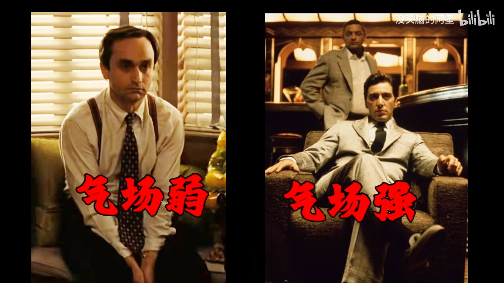

## 前言

- 本文仅为[该视频](https://www.bilibili.com/video/BV1QaKnzCEUj)的文案，并不完全代表个人想法
- 兼听则明偏信则暗
- 与很多其他书籍观念类似，包括但不限于《被讨厌的勇气》……

## 文案

### 气场

为什么这些人看上去气场很强大？因为他们采用了所有增加气场的方式。电影《教父》中说：“伟大的人并不是生来就伟大，而是在成长过程中一步一步变得不平凡。”而提升气场就是我们的开始。强大的气场能够让自己在工作和生活中占据主动。那什么是气场？如何提升气场呢？今天我们结合《了凡四训》，聊一聊关于气场的话题。

#### 什么是气场

什么是气场？了凡四训中，袁了凡讲了一个现象：他和大家一起参加科举考试的时候，总能看见有人会自带光芒。换句话说，有些人的气场很强大，他安静地站在那里就能吸引到别人。所以，气场从本质上来说是我们的眼、耳、鼻、舌、身接收到的信息，映射到大脑的潜意识中，潜意识开始迅速解读并反馈信息，并以电流的方式对大脑进行刺激，最终由大脑意识层解读出两个信息：危险和强弱。

比如在静态状态下，眼睛看到这个人的外貌、穿衣、肢体动作等一切视觉可接收到的信息，开始迅速解构信息，并分析这个人是否是强者，会不会对自己构成威胁。如果是动态状态，这个人走路的感觉、包括我听到的声音的频率以及稳定性等一切耳朵可以接收到的信息，甚至环境、味觉对大脑的刺激，也是原始信息中的一部分。从上面的分析，我们能够理解气场是潜意识的产物，而潜意识也对我们识别气场起到了决定性作用。

#### 潜意识如何识别气场

为什么袁了凡可以看到一些人带着光？那是因为他的潜意识训练已经达到了一定程度，能够迅速分辨一个人气场的高低。那么潜意识是如何识别气场的呢？答案就是我们对某个人的初步印象，它包括外貌、穿着、眼睛、肢体动作、走路的感觉、声音频率等等。这些所有信息会同时同步映射到潜意识里，潜意识进行分析，形成一个初步的感觉，就形成了气场。而潜意识的分析过程，实际上就是我们用自己的认知对别人进行评判的过程。实际上很多人对于气场的认知趋于相同，这也是为何一个人强大的气场，会同时被很多人感知到，因为这些人的潜意识分析过程都是一致的。

一个气场强大的人，往往会有一些不同寻常的外在表现（可以参考绝命毒师中的“炸鸡叔”）：

第一，**眼神稳定**。为什么稳定很重要？因为如果你眼睛乱看，在原始环境中的意义是你在搜集信息，而信息的作用只有一个——你在随时准备逃跑。这样不安分的人，会第一时间被大脑定义为低价值，自然毫无气场可言。所以，眼神稳定是气场的基础。

第二，**动作少**。在集群场合中，一个高频回应别人、步履匆匆的人，往往有同一种身份——服务员。只有站在服务者的位置，才会对周遭的变化敏感且必须快速回应。而站在控制者的角度是不需要多余动作的，所以不要急于回应。

第三，**微笑**。任何群体场合都不会欢迎一脸严肃的人。严肃的表情并不是不好惹，而是给人一种恐惧，而严肃的另一面就是不安，而不安的原因是自卑。所以，我们会更觉得微笑的人看起来更有吸引力。

第四，**无防御姿态**。防御的第一个下意识的动作就是双手交叉抱在胸前，此时他传达出一条信息：你抵触于当下的社交环境，你是弱小的、恐惧的。而真正拥有气场的人，从来都是敞开心扉的。

外在的表现内容，而这一切的外在都是由一个内在的词语支撑，那就是沉稳。因为沉稳的人会有发自内心的坚定和自信，这种自信并非盲目的自大，而是基于对自己能力深刻的认识和充分的准备。正如古人云：“知人者智，自知者明。”一个了解自己、信任自己的人，才能在面对挑战时保持从容不迫，从而散发出强大的气场。

袁了凡用一个故事向我们展现了沉稳之人的魅力所在。有一年，他进京觐见皇帝途中，遇到一个叫夏建索的人，一下子就被他身上温和包容的光芒吸引。这是因为虚怀若谷而散发出来的。袁了凡就对另一个朋友说：“凡是上天要使某个人发达，在还没有降福给他之前，就会先开启他的智慧。这种智慧一旦开启，浮躁的人就会变得沉稳，放肆的人就会变得内敛。”夏建索能如此温良恭敬，一定是上天启迪了他。等到开榜时，果然夏建索一举高中。由此可见，内外双修才能真正改变我们的气场。

#### 如何提升气场

如何提升气场？男人世界的圣经《教父》有言：“伟大的人并不是生来就伟大，而是在成长过程中一步步变得不平凡。”提升气场是让我们变得不平凡的起点。接下来让我们由内而外完成蜕变。

##### 外在气场

第一，**面部表情**。发哥露出霸气侧漏的一面时，你会发现他最引人注目的是眼神和微笑。人在不自信、紧张的时候，会不自觉地眨眼，且次数很频繁，眼神不定。而发哥正好相反，当他注视别人的时候，眼神始终聚焦对方，保持微笑。被看的人好像受到了极度的关注。从心理学上来说，当人的大脑感觉被关注，就会对你造成心理压制，也会主动将对方列为警惕对象，一定程度上放大你的紧张情绪。生活中最简单的做法就是与人交流时，**眼神不要刻意回避，要坚定且有神，但不宜超过五秒**，否则攻击性太强，容易被打。时间长了，你会发现越来越多的人愿意与你交流，你的眼神无形中给你带来很多的便利。这就是面部表情产生的气场力量，它能通过视觉效果影响别人对你的判断。如果你试了很多次，发现没有办法坚定自己的眼神，也无法控制自己的表情，那可能是不够自信。不用怕，多读书，知识储备足够，到哪里都有自信。

第二，**人体打开度**。这一组照片非常明显，即使你不知道他们的身份，也会在见面时瞬间明晰他们的性格地位。因为恐惧会激发生存的本能，双手护在身前，且做蜷伏状。而身体打开可以表达恐惧度降低，也就是你的气场。这是第二组照片，我们明显能够感知组图的慌乱，而内心慌乱的一大特征就是身体失去稳定性，且会出现小动作。注意第二张图的手部，呈现出一种无法违抗的气场。这里不得不再次提到手部的重要作用。如图是人体手势的三大能量区：低能区是腰部以下的区域，如果守在这个位置，整个人会呈现出极度的不自信；超能区是肩部以上的位置，这是表达亢奋的一种方式，但很容易呈现出攻击性气场；腰部到肩部的区域是最推荐给大家的手势范围，强气场却不会有过激的攻击性。

第三，**对话**。人们很多时候都没有意识到，谈话的关键并不在于说，而是不说。一个有威势的成年人，往往是惜字如金的。首先，顿挫。喋喋不休是气场最忌讳的词，因为它意味着你对自己所讲的话不自信。语言的力量感来自少而精、慢。而《教父》中柯梁在面对议员的羞辱和威胁时，整个过程不发一言，但当议员即将离开的时候，给了唯一一句回复：“我的出价是……一分没有。”中间常常停顿，给了这句台词以极大的力量感。其次，沉默。沉默表达拒绝是黑手党最常用的谈判技巧，因为他们知道沉默是一种压力，心理强度低的人会首先给出报价。这是年轻的老教父谈判房租的情景，每次对方开价，他只是笑笑不说话，直到对方给出他满意的价格。退一步讲，如果你做不到用沉默压制对方，那就不要做那个先开口的人。最后，眼神。记住，当我们看他的时候，脸转向他，而我们的眼睛必须是聚焦的。时间不能过短，这意味着我们心虚了；亦不能过长，因为这会带来极大的攻击性。

##### 内在气场

内在气场：这是一个无需表现、自然散发的气场。

第一，**情绪**。在重要的场合，谁先表露出紧张，谁就处于劣势。这时情绪的气场就出来了。氛围越压抑，情绪越镇定的人，会给周围人产生莫大的压力，气场范围扩大。而越慌乱的人越容易暴露出自己的缺点，比如演讲、开会紧张等等。增强内在气场的一个有效途径就是学会控制情绪。别人越急，你越淡定，把强势的一面展示给对方。很多人一到这种场合就紧张，不要害怕，情绪控制是可以练习的。多去陌生的场合和陌生人交流，时间长了，你自然不再恐惧，轻松应对紧张的场合。当然，如果你真正了解紧张情绪的本质，可能不需要练习也可以淡定自若。

第二，**短暂沉默**。有句话叫“此时无声胜有声”。在必要的时刻保持沉默，可以让对方扑空，主动提出让步空间。比如当别人求你办事，要求太过分，你就给他沉默一击，给予他无穷的压力。**但前提必须是对方需要你，你手上有掌控他的筹码**。**如果你们没有利益相关，你的沉默将会引起两个极端：误认为你无礼或彻底无视你，反而极大削弱了自身的气场**。同时，**沉默还建立在未知基础上**。比如上级对下级沉默才不会起反作用，只有在你能给对方未知的时候，才能发挥沉默的作用。所以当自己没有十足把握压制对方的时候，不要轻易选择沉默。

第三，**自信和原则**。这是让气场持久发挥的燃料。毒枭找教父谈生意，教父知道这生意绝对弊大于利，便坚定拒绝并表态绝不合作。这个坚定给对方留下了沉稳的气场。而大儿子桑尼看到不错的利益，急切露出想要合作的想法，这个错误让敌人抓住了弱点，导致教父被暗杀。谈生意的时候最怕什么？最怕别人知道你内心的想法。教父的果断拒绝，目的是撇清关系，暂时断绝对方的念头，看局势而动。之所以这么做，一是因为教父对未来的判断充满自信，二是他对此生意有所顾虑。而我们很多时候在生活中面对别人的无理要求，有时哪怕吃亏也会做出让步，但其实那些有违背自己原则底线的东西，我们果断且明智地拒绝，并不会带来道德性的谴责，反而一个“不”字能够让你避开很多的麻烦。

第四，**内修**。这也是最重要的环节。以上所有都仍然浮于表面，普通人在没有足够的财富和权力支撑下，最能够变化的就是自己的内心。当我们不断提升认知，不断通过实践改变自己，让内心逐步强大的时候，面对任何状况都可以淡定自若。此时我们可以表现出以上所有的动作，实现内外同步，真正体现出强大的气场。这种气场就是不卑不亢，它与财富无关，但却能迸发出强大的光芒，可以照射所有人。

### 反因循

改命的实用方法，名为“反因循”。这个方法来自于《了凡四训》主角袁了凡。了凡先生说：“天下通明俊秀不少，所以德不加业，业不加广者，只为因循二字耽搁一生。”意思是天下聪明俊秀、有才智的人很多，他们之所以不能够修养本我的德性，所要做的事无法拓展的原因，只是因为“因循”这两个字，让自己得过且过，以至于耽搁了他们的一生。这句话里有两重含义：第一，天下间的聪明人，即便再聪明，如果不愿意在本我的品德上不断精进和学习，不断打开释放、开阔自己，那么也很难过好这一生。第二，这些聪明人不愿意精进和学习的原因，是困在了“因循”这两个字里，所以才最终耽搁了一生。由此我们知道，因循使人固步自封。然后借助老子的阴阳有无的理念反应，“循”概念由此而生。

#### 反因循的定义

因循的定义：首先我们理解一下何谓“因循”。**“因循”这个词字面上的意思是研习守旧、懒惰、不愿意改变**。

《汉书·循吏传序》说：“光因循守职无所改作。”这句话描述了霍光在汉昭帝时期的行为。霍光在汉昭帝幼年时执掌政权，面对国家财政空虚、百姓困苦的局面，他选择沿袭旧制，坚守职责，没有进行任何改革或创新，最终导致他的失败和被罢免。成语“因循守旧”也来自于此。

所以，“因循”如果放在现在，可以理解成顽固守旧的老师，无法接受新的知识和创新思维；老旧思想的上司，无法接受新人的建议和好的点子；封闭自我的本人，无法接受一切，人生止步于此。

“因循”是缺乏创造力、不愿意做出任何改变的代名词。那么从字面上说，“反因循”就是愿意去改变、愿意去创造、愿意去学习和接受新的理念和知识。

**“反因循”意味着这样一个信念：通过不断的精进和学习，我们可以让自己变得更好**。这个信念也可以这样来表述：每一个人的才能、命运都不是固定的，只要你愿意终身学习，愿意去不断接受新的理念和知识，就可以改变你不如意的状态，过自己想过的生活。

#### 袁了凡的逆转人生

袁了凡的逆转人生：袁了凡本人就是“反因循”的实践者，他的这个信念是被云谷禅师的一句话点醒的。云谷禅师对袁了凡说了这么一句话：“汝二十年来被他算定，不曾转动一毫，岂非凡夫？”这句话的意思是：你袁了凡二十年来被一个算命先生算定了，一点都不曾想到可以有别的活法，难道不是一个凡夫吗？云谷禅师为什么要对袁了凡说这句话呢？这要从袁了凡的经历慢慢说起。

袁了凡原来的名字叫做袁表，号雪海，一般人叫他袁学海。他明朝嘉靖十二年（公元 1533 年）出生在浙江省嘉善县的渭塘镇，祖籍是江苏吴江。在他 14 岁的时候，父亲就去世了。按照父亲生前的心愿，他走上了学医的路。本来平静的生活不久被一位算命的孔先生打破。算命先生说袁学海是当官的命，并且精确地说出了他什么时候会考取什么功名，什么时候能当上官。于是袁学海毅然走上了科举和当官的道路。神奇的是，他走的每一步都没有逃出孔先生算出来的命数。

慢慢地，他觉得人生就是那么回事，一切都是命定的。也正是这个时候，袁学海前往南京栖霞寺拜访了老乡云谷禅师。云谷禅师知道他的情况以后，首先就对他说：“没有想到你不过是一个凡夫俗子，二十年的人生居然被一个算命先生给算定了。”这句话传达了很强烈的信息：**一般人之所以一辈子过得平庸甚至不如意，就是因为他们把自己框定在一个叫“命运”的格局里，这就是“因循”**。

因为袁学海在这些年里已经停止了自我的发展，而云谷禅师的这句话犹如当头一棒，袁学海决定改变自己。于是把自己的名字改成了“袁了凡”，意思是要了结繁复的生活。而改名对他来说只是一个由头。袁了凡真正的想法就是“反因循”。如今的社会，很多人遇到逆境，会诚心请大师改名，以为改名就会带来好运。

改名会不会带来好运呢？答案是会又不会。如果你是请人改名，但是并没有改掉你原来的信念和行为，那么改名只会起到心理暗示作用，因为你相信改名会带来好运，所以会觉得改名之后顺利了很多。但是这样的结果往往是，因为你并没有真正改变什么，过一段时间后还会遇到不顺利的事情，然后你会觉得这个名字就不灵了，这个大师不太灵，便再去找新的大师，找新的改名方法，最终一辈子就在求神拜佛中浑浑噩噩地度过，只改了名，实际上还是命运的奴隶。

袁了凡改名改掉的不是一个名字，而是改掉了“旧我”。他真的在“反因循”。他仅仅保留本来的姓氏“袁”，因此他其实是在接纳了原始本我的基础上，又重生了一个新的本我。他改名了，凡想了断的无非就是“因循”的轮回，是附加在生命之上的框框和桎梏。

从袁学海到袁了凡，是从“因循”到“反因循”的巨大转变。但这也指出了两种人生道路：**一种是相信命运，我们会固定在某种格局里，相信一切是被规定的，是“因循”的道路**；**另一种也是相信命运，我们会相信命运的系统是开放的，可以无限成长和扩张，是由自己去创造的，是“反因循”的道路**。那么你想要走哪一条道路呢？

#### 为何我们难以“反因循”

为何我们难以“反因循”？如果你看到这里，我想你可能会问到这个问题：“我当然希望选择‘反因循’的道路，但中华上下五千年，有几人能实现呢？”的确，袁了凡之所以出名，就是因为物以稀为贵。所以我们普通人是难以“反因循”的。

原因有三：

第一，**人的天性**。**人的天性是趋利避害**，其实这也是从最早的生物——草履虫基因里就带来的内容。普通人按照“因循”的方法做人做事，可以在最小的风险中获得最大的利益，因为“因循”就是走前人的路，前人都走成功了，我照着老路走，风险是很低的，而且也极易获得成功。所以人的天性让我们更倾向于“因循”，减少改变。

第二，**熵增定律**。在任何一个封闭的环境中，里面的事物必然趋势都是从有序到无序直至死亡。这是一个悲伤的结局，人类也难以逃脱。作为普通人，同样也是从有序到无序，“有序”就代表了“因循”。在一条定律面前，我们在不抵抗的情况下，自然就会走向“因循”。

第三，**认知局限**。有一部分人会发现自己需要“反因循”，因此会采取一些方法去改变，但热度不足三分钟，最终只能放弃，继续循环下去。**知而不行**，只是未知。但在这些人的认知里，只要发现了问题，就好像已经解决掉了问题，没有行动。这种认知局限让这一部分有觉醒意识的人，最终还是倒在了门口。

以上三点不知道哪一点是对应到了我们的头上，但事实上我们目前还在“因循”当中，这就是为何我们难以“反因循”的原因。

#### 如何“反因循”

如何“反因循”？袁了凡告诉我们，很多人以为我们做不到“反因循”，所以一生只能走“因循”的道路，但其实我们只要愿意，都可以走“反因循”的道路，都可以让自己过得更好。

“因循”与“反因循”的划分，跳出了关于命运的传统话语模式，完全不理会命运到底是先天决定的还是后天决定的，而是把命运还原成生命本身。回到生命本身，具有不断成长的特性这个基点，专注于如何让生命成长。所以真正“反因循”的方法就是**专注生命本身**。

就生命成长而言，不同的信念开启不同的人生模式。也就是说，并不存在固定的命运，命运是一个变量，你怎么理解它，就会获得怎样的命运。

相信很多朋友已经看过《肖申克的救赎》，这是一部改编自美国作家斯蒂芬·金小说的电影，被认为是电影史上堪称完美的作品之一。我很喜欢这部电影，每年都会重温一遍，常看常新。电影的剧情并不复杂，讲的是一个叫安迪的人，因为妻子和她的情夫一起被谋杀，而被怀疑是凶手。虽然安迪并没有杀人，但在所有的证据都指向他的情况下，还是被作为杀人犯关进了监狱，开启了痛苦且无尽头的服刑生活。但安迪坚信自己是清白的，并且凭借自己的信念和耐心，最后不可思议地逃出了监狱。

这部作品带有寓言色彩。在某种意义上来说，我们活在世俗的社会里，活在各种制度下，其实就是活在各种“监狱”里。普遍患有“体制症候群”。小说借叙述者雷德之口这样描述“体制症候群”：“我曾经试图描述过，逐渐为监狱体制所制约是什么样的情况。起先你无法忍受被四面墙困住的感觉，然后你逐步可以忍受这样的生活，进而接受这种生活，接下来当你的身心都逐渐调整适应之后，你甚至开始喜欢这样的生活了。什么时候可以吃饭，什么时候可以写信，什么时候可以抽烟，全都规定得好好的。大多数人的一生就是这样被模式化、被规定的一生”。但是这个世界上仍然生活着像安迪那样的人，有些鸟儿天生就是关不住的，它们在努力克服这种“体制症候群”。

**“因循”的道路就是被体制化的道路，体制化“因循”意味着被工具化，“反因循”即拒绝工具化**。

所以最终我们该如何“反因循”呢？

首先，**我们要做一个活生生的人**。当你发现自己逐渐被体制化以后，需要立即开启大脑的飞速运转，将自己从体制的监狱中剥离，至少是从思想层面的剥离，让自己不要成为长着翅膀但不会飞走的“体制鸟”。

其次，**我们要做一个关注生命的人**。如果我们在名利面前，逐步忘记了“我的生命很重要”，那么此时请尽快刹车，将生命放在第一位，更要将生命的经历和内心的体验放在第一位。名利只能是附庸，请不要将名利凌驾于自我之上。

最后，**我们要做一个关注成长的人**。如果我们关注了自身，关注了生命，但认为人生止步于此的时候，请立即改变这种认知。**生命本身是在成长中体验、在体验中成长的**。所以我们仍然无法离开现实世界，我们需要在实践中让生命得以成长。

#### 写在最后

“因循”和“反因循”也可以说是两种不同的思维方式。**“因循”是固定性思维，“反因循”是成长型思维**。

心理学家卡罗尔·德韦克提出“终身成长”的概念，认为人的命运之所以不一样，是由两种不同的思维模式造成的。一种思维模式是固定型思维模式，一种是成长型思维模式。固定型思维模式的人以为智力是与生俱来的，因此放弃了学习和挑战，经常一蹶不振。而成长型思维模式的人相信智力是可以提升的，因而会抓住一切学习和挑战的机会，不断找到下一个努力的方向。一旦选择了“因循”的路，你的人生就已经失去了希望。而当你跨出去走出“反因循”的第一步，你的人生就有了无限的可能。

### 正确区分善恶

我们以为的善恶是这么分的，而最终的结局，帅气的外表可能很恶，而凶恶的外表可能很善。所以外貌、穿着、谈吐都是与善恶无关的内容。此时我们可能会思考，普通人只有双眼来识别一切，所以很容易被外表蒙蔽。到底如何才可以判断善恶呢？哪些行为看似是善行，但本质却不是善行呢？

接下来，结合《了凡四训》的“积善之方”篇，让我们真正了解披着善行外衣之下的假善行，他们分别是伪善、老好人、宣传善、软弱，这些都不是真正的善行。接下来逐一详细分析。

#### 伪善不是善

《了凡四训》中有一个故事，有几个读书人拜见中峰和尚问道：“佛家讲究善恶报应，如同影子跟随身体。但是现今某某做了不少善事，他的子孙却并不兴旺；某某做了不少恶，却家族兴旺。佛讲的好像没有什么道理”。中峰和尚回答：“一般人陷于成见或偏见，还没有打开正知正见的眼睛，往往会把善的当作恶的，把恶的当作善的，不去怪自己善恶不分，反而怪上天的报应不准确”。

大家听得有点云里雾里，问道：“我们怎么会把善恶弄反呢？”中峰和尚就让大家举几个他们认为善或者恶的例子。

有人说：“骂人打人是恶，对人有敬爱、有礼貌是善”。
中峰和尚说：“其实未必。”

还有人说：“贪财、非法占有是恶，廉洁、坚持操守是善。”
中峰和尚说：“其实也未必。”

其他人又举了很多例子，但中峰和尚都说：“未必。”

大家就让他解释。为什么中峰和尚说“未必”呢？

中峰和尚说：“有利于别人的就是善，有利于自己的就是恶。如果你能会责备其他人，那么打骂人也是善；如果你只是为了自己的私利，那么敬重别人也是恶。”

中峰和尚讲清了衡量善恶最重要的标准：利己还是利他。至于其他的种种，都是外在的形式。但很多人以表面形式来判断善恶，往往混淆了善恶。我们所谓的“坏人”，不过是对自己不好的人；而所谓的好人，又不过是对自己好的人。我们做善事能帮助别人，就是出于公心，出于公心就是真诚。如果只想到自己的利益，就是私心，出于私心就是伪善。发自内心的行善就是真善，而模仿别人做形式上的表演就是伪善。

我们每个人都有私心，从而混淆了善恶。区分善恶之时，潜意识中已经涵盖了自己的利益需求，将利于自己的定义为善，有害于自己的定义为恶。最终因为这种私心，会认为好人没有好报，坏人没有恶报。不过要完全做到利他并不容易。

金庸先生认为，名利地位是绝大多数人都想争取的，包括他自己在内。因此他提出了一种道德判断：**如果所作所为对大多数人有利，而同时自己也能得到名利，那是上策；如果对大多数人无损，而且对自己有利，那也可以接受；但是为了一己私利而去损害大多数人的利益，那就是不道德的**。

有一个法师开讲座的时候，有人问他：“为什么我做了那么多好事，但还是混得不好呢？”法师就掏出来 500 元给他说：“你去帮我办一件事。”那个人问：“什么事呢？”法师说：“买一辆汽车。”那个人就懵了，说：“500 元我怎么买汽车呢？”然后法师就重复了他的疑惑：“是啊，你也知道 500 元怎么能买汽车呢？”

法师的回答其实是说，**假如我们做了什么事都是想交换其他利益的话，那你想得到什么就要付出什么样的代价**。如果你付出了 500 元，却想要得到一辆汽车，那当然是不可能的。所以做了好事还是不顺利，你就应该梳理一下什么事不顺利。当然前提是要把什么事顺利、什么事不顺利界定清楚。如果不把这个基本点梳理清楚，只是泛泛而论，觉得做了很多努力还是不顺利，只会让自己陷入一种沮丧的情绪里，总觉得自己很委屈，这样于事无补。不如冷静地观察，到底是什么让自己觉得不顺利呢？自己到底做了什么？自己真的做了好事吗？真的不是出于私心的伪善吗？想清楚以后，再将自己所有的境遇打通和分析，或许有不一样的收获。

当然还有一个更高的角度，就是善恶报应。对于那些非凡的人物，不如意的现实境遇就好像一种常态。

子路问孔子：“从前我就听老师讲过‘做善事的人上天会降福，做坏事的人上天会降祸’。如今您心怀仁义，坚持德信已经很长时间了，怎么处境还如此困顿呢？是老师的仁德不够，不能被人们信任，还是老师的智慧不够，不能被人们信服呢？”

孔子说：“你还是太年轻了。如果有仁德，就一定会被人相信，那伯夷、叔齐就不会饿死在首阳山；如果有智慧，就一定会被人任用，那比干就不会被剖心了。忠心如果都有好下场，那关龙逢就不会被杀；忠言如果都能被听信，那伍子胥就不会被追杀了。”

孔子后来还对子贡说：“好的农夫庄稼种得好，但不一定有好的收成；好的工匠手工精巧，但不一定能够让所有人满意；君子树立自己的理念，以此创建政治主张，但不一定别人就会采纳。现在为求别人采纳，连自己的理念都不再坚持，这说明你的志向不远，思想不够深入。”

孔子的意思很清楚：**君子应该只去做自己该做的事，结果如何应交给天命，没有必要去纠缠“好人没有好报”的问题**。**好人在做好事的过程中就已经得到了好报**。另一个更深层次的意思是：**善的回报不一定是世俗层面的荣华富贵**。子路看到了孔子当下的境遇，但在困顿中，孔子成就了伟大的心灵。不仅让孔子在世间获得了灵魂的解脱，也让他在后世仍为人称颂。

#### 老好人不是善

《了凡四训》中，袁了凡对行善也做了区分。一个人所具有的纯粹的社会责任感，叫做“端”；有媚俗之心，总想讨好别人，叫做“曲”。这是在提醒大家，不要把老好人的不讲原则当作善良。

孔子在《论语》中以三种人为例，说明圣贤与世人对善的不同判断。

在孔子看来，“乡愿，德之贼也”。
王阳明说：“乡愿在君子面前装作忠诚清廉，而在小人面前就会选择同流合污，换取和小人和谐共处。”

那什么样的人算是“乡愿”呢？用现代的话来说，就是老好人、伪君子。看似谨慎善良，对谁都不得罪，其实言行不一，极其虚伪，善于谄媚，有时甚至会助纣为虐。

孔子认为，比起“乡愿”，“狂、狷”之人更胜一筹。假如无法做到君子的境界，那么“狂狷”之事也可以接受。为什么呢？因为狂士虽然个性张扬，有时过于激进，但勇于进取，遇见不义之事会直言不讳；狷士虽然有点孤僻，有时会选择袖手旁观而洁身自好，但绝不会选择与小人同流合污。

由此可见，圣人眼里的好人和一般人认为的好人不同。一般人看到一个表面老实的人，就很容易认为他是善良的人并肯定他，但这些所谓的好人很可能是没有原则的老好人。在圣人眼里，这些人反而会败坏道德，远不如那些有个性又有原则的人。

一般人对善恶的判断，往往会受到自身利益的影响，很容易相信没有损害自己利益的人是善人。圣人则以天下为己任，对善恶的判断往往会站在更高的点。所以一般人和圣人对善恶的判断会有天差地别。天地鬼神庇佑善人，报应恶人，与圣人的标准不同，而和一般世俗人的见解完全不一样。

因此，凡是要行善积德，绝不可只依赖自己的所见所闻，而应探寻至内心最隐秘细微的地方，默默地省察自己的起心动念，并加以洗涤和净化。纯然的救世之心，那就是“端”；如果有一丝一毫的媚俗之心，那就是“曲”。纯然爱人的心，那就是“端”；如果有一丝一毫的嫉恨之心，那就是“曲”。纯然尊敬他人的心，那就是“端”；如果有一丝一毫的玩世之心，那就是“曲”。这些细微的区别，都应当仔细分辨。

德国哲学家汉娜·阿伦特提出了“**平庸的恶**”的概念，这个概念有点类似于孔子说的“乡愿”，两者都讲了社会里普遍的误解，把老好人当做好人，但老好人实际上正是恶的同谋。

阿伦特在研究德国纳粹战争罪行时，遇到一个令他困惑的问题：纯粹的行为是如何变得如此邪恶和残忍的呢？

他深入研究了二战期间负责执行大屠杀的纳粹官员，并在以色列对其审判的过程中进行了观察。阿伦特注意到，纳粹官员并不是典型的邪恶分子，他们也没有展现出强烈的憎恨或仇恨的情绪，相反，他们似乎是一个平凡的人，一个机械的执行者，只是按照指令执行他的职责。

这个观察引发了阿伦特对“平庸的恶”这一概念的探讨。他认为，官员的纳粹邪恶行为并非源于异常的邪恶本性，而是来自于平庸普通的心态。这种心态使得这些官员能够将自己的责任推卸给上级，将自己的行为合理化为只是遵从命令。在他们的眼中，所做的一切似乎只是在例行公事，忠实地履行自己的职责而已。

阿伦特认为，形成“平庸的恶”有两个关键因素。

第一，**官僚体制和群体行为**。纳粹政权建立了一个高度官僚化的体制，这种体制将责任分散到各个部门和个人，每个人只需要承担自己所负责的范围内的职责。**这种集体行为导致责任的模糊化和推卸，个体的道德判断被削弱，他们逐渐失去了个人责任感**。

第二，**普通人的思维惯性**。阿伦特指出，**很多人在压力下或者面对道德困境时，往往选择遵循社会规范和权威的指示，而不去思考和质疑**。在纳粹德国，普通人普遍接受了集体意识形态的洗礼，将领导者的命令视为绝对的真理。这种平庸惯性使得“平庸的恶”能够在一个普通人的行为中扩散和蔓延。

“平庸的恶”这个概念在提醒我们，**邪恶不一定来自个体的恶意，而可能是普通人在特定环境中，受到体制、权威或集体思维的影响所产生的结果**。

其实**我们每个人都有责任去质疑和思考，不应该盲目遵从，不能轻易将自己的判断和责任推卸给他人**。**个人面对社会风气方面的恶习，即使没有勇气去反抗，也可以保持沉默，不要为了眼前的利益牺牲自己内心的原则**。

阿伦特说：“不需要什么激烈的社会运动，就可以改变这个社会，靠的是什么呢？是个人的良知。”

这个说法让我们想起了王阳明。王阳明生不逢时，他生活的那个时代政治黑暗，社会风气堕落，他却倡导致良知，把希望寄托于个人的良知觉醒。

王阳明的一生信奉良知，不管有多危险，都会去做自己该做的事。他的良知告诉他，这件事不对，即使孔子说这是对的，他也不会理会。

他的学生问他：“为什么老师您经常陷入绝境，却总能绝处逢生呢？”
王阳明回答说：“因为良知。”

他的意思是，当他按照良知去指引做事情的时候，是在听从天命，会得到上天的眷顾。真正的善绝对不会被周围的闲言碎语、恶风陋习所屈服，内心深处的良知会指引我们做出最正确的选择。听从自己心底的善，终将会迎来属于自己的福报。

就算在地狱，就算在无尽的黑暗当中，都要怀揣着对于光明的信念，要让自己成为光，去温暖别人。这就是善。
就算所有的人都相信魔鬼，只要有你一个人相信天使，天使仍然会眷顾这个世界。

如果你不再相信天使，那你可能就成为魔鬼。在黑暗里，如果你不相信光，那你就只能在黑暗中沉沦。

> PS：即使世界不公，依然相信正义，毕竟曾经有过

#### 宣传善不是善

> 感觉过于理想主义了，可能我目前还未超脱现实，处于六道轮回

《了凡四训》中袁了凡区分了两种善：阳善和阴德。其中，凡是做了善事而被人所知道的就是“阳善”，做善事却不被人所知道，就是“阴德”。积阴德，上天会报答的。有“阳善”，会在世间享有盛名。

> 类似于营销

袁了凡鼓励我们积阴德，因为上天对我们所作所为都了如指掌，只要我们做了善事，就会一定得到上天的回报。

做了善事，特意让他人知晓，给自己带来了名望，自然也算是一种福报，但这种名声有时效性，且大举宣传换来的名利来路不正，必然会招来祸患。

如果你有心，会经常在生活中发现这两个现象：假如某人做了一件好事，被广泛宣传，就会引发各种议论，一传十、十传百，事件到了最后就会出现各种反转，当初的好事可能变成了别人眼中的**作秀**。

**假如某人想达成一个目标，且急不可耐地告诉其他人，那他往往难以实现**，反而是**那些把自己想做的事悄悄藏在心底的人，能实现目标**。等到大家都知道的时候，他的事情就已经做成了。

这两个现象说明了一个奇妙的规律：**舆论会让事情偏离正常发展的轨道**。这大概是我们为什么要积阴德的理由之一。**不留名的善给予了行善者更大的自由，他们可以自由选择适合他们的价值观的善举，而不受他人期盼或评判的影响**。**这种自由使他们更容易去追求一些被社会忽视但真正有意义的事情**。所以行善没有必要让人知道，更不应该去炫耀。

就像基督教马太福音中耶稣训诲说“所以你在施舍的时候，不要在你面前吹号，像那些假冒为善的人，在会堂里和街道上所行的，故意要得到人的荣耀”。

佛教里有福德和功德的说法。禅宗里有个关于梁武帝和达摩的著名故事，讲的就是福德和功德的区别。南朝的梁武帝是很虔诚的佛教徒，把佛教定为国教，盖了近 3000 座寺庙，四次舍身出家，严格遵守佛教的戒律，吃素不近女色，生活简朴。但他的生活好像还不太幸福。所以当达摩来到中国的时候，他邀请达摩到南京的皇宫暂住。

一见面，梁武帝就问达摩：“我做皇帝以来，造了几千座寺庙，抄写了无数的佛经，供养了无数的僧尼，有什么功德呢？”
没想到达摩回答：“没有什么功德。”
梁武帝非常失望，不甘心地追问：“为什么呢？”
达摩回答：“你这样刻意做好事，求回报，当然也会有回报，只是这种回报还在六道轮回之中，仍是虚幻，并不是真正的解脱，也不是真正的功德。”

六祖慧能评价这件事，说达摩讲的没有错，是梁武帝没有真正的觉悟。慧能解释说：“造寺、布施、供养只是培植福气，不能将培植福气当作功德。功德在于佛性，不在于福田，而是要从自己的佛性上产生功德。如果自己的思想还是虚妄的，那么你就不可能有真正的功德。每时每刻超越分别，向自然的活着，就会有很大的德行。行为上总是恭敬，自己修炼身体即为‘功’，修炼心灵即为‘德’。功德来自自己的心性，与福德并不相同。是梁武帝对于佛法没有正确的理解，而非达摩祖师有什么错误。做好事不留名，还是表面的；做好事不求回报才是根本。”

也就是说，以清净的心去行善才是最重要的。**判断是否真正行善只有一个标准，就是是否发自内心**。行善是人性的自然流露，并不是一件特别值得张扬的事情。所谓积阴德，就是将行善融入日常的生活方式中。看到路上的垃圾随手捡起来，放进垃圾桶；听到别人在议论某人的八卦，不参与，甚至还会为某人澄清一些事实；每天挤地铁或公交去上班，有谁需要让座，就给他让座。这些很小的事情都是在积阴德。美国企业家古铁雷斯说：“一个人的命运并不一定只取决于某一次大的行动，我认为更多的时候取决于他在日常生活中一件小小的善举。”

#### 软弱不是善良

《了凡四训》中，袁了凡说**行善要注意“偏正”**。**“偏”有偏颇的意思，“正”有全面的意思。做好事不能偏颇于异端，而忘了全体。偏于异端，就容易好心办了坏事**。

袁了凡举了两个例子来说明这一点。

第一个例子：吕文义辞了宰相之职后，衣锦还乡，很受大家的尊重。有一次，一个喝醉了的同乡在吕家门口破口大骂，还砸烂东西。吕文义并不生气，交代自己的仆人不要和喝醉的人计较，关上家门不再理会。第二年，这个人犯了死罪，被送进了大牢。吕文义后悔地说：“如果当时我稍稍计较一下，把他送进官府，追究一下他的责任，小小的惩罚恐怕会让他引以为戒。我当时只是想自己心存厚道，没想到反而纵容了他的恶习，到了今天这个地步。”袁了凡认为这是好心办了坏事。

第二个例子：有一年闹饥荒，穷人大白天在街上抢粮食，某富豪告到县衙，县衙不予理会，穷人更加肆无忌惮。富豪就私下找人，把抢粮食的人全都抓起来，羞辱责罚，终于平息了抢粮风潮。如果没有这个富豪的行动，这是坏心办了好事。

袁了凡把善定义为“正”，把恶定义为“偏”，是有一定洞察力的。**对于一件事情的道德判断不能依靠一些教条，而是要衡量这件事是不是顾及了全体，而不仅仅是顾及了某一面，那就是偏向于恶了**。

李文义出于厚道，不计较醉汉的行为，把他放了，却没有想到这样是在纵容他，反而害了他。这是顾及了自己的发心以及名声，却没有顾及会给对方带来什么后果，所以这样的行为是善终带恶。富豪想干的事情本身是坏的，完全出于一己私利，但客观上带来了好的社会效应，所以这样的行为是恶中带善。

袁了凡讲了这两个例子，是想说明**动机和效果不一定一致**。我们应该提醒自己，**在行善的时候要有整体的考量，仅有好心是远远不够的**。**有的时候看似恶的行为也未必会带来坏的结果**，即所谓“好心会办坏事，坏心也能办好事”。

> 多角度思考，多元思维模型

但细细推敲，这两个例子远远没有那么简单。先说第二个例子，这个例子看上去很简单，其实很复杂。饥荒年代，穷人在街上抢粮食显然不合法，但在道义上可以理解，值得同情。当一个社会在制度上出现严重问题时，就会出现激烈的贫富冲突。这个时候穷人和富人其实都是受害者。

袁了凡举了这个例子，我觉得真正引起思考的不是“坏心办了好事”，而是假如你是一个有钱人，在贫富冲突的社会里，你会如何自处？假如你是一个穷人，在贫富分化的社会里，你又该如何操作？

第一个例子也不仅仅是好心办了坏事，**我们常常误解了“以德报怨”和“忍辱”，因而也常常把善良理解成软弱怕事**。但实际上**真正的善良是有锋芒的，坦荡而无所畏惧的**。

孔子在和学生聊天时，学生问他：“以德报怨怎么样？”
孔子反问了一句：“假如以德报怨，那么我们又如何报答对自己有恩德的人呢？”
然后下了一个结论：“以直报怨，以德报德。”

孔子这个说法符合人情常理，好像没有什么问题。确实，假如我们以德报怨，那不就是恩怨不分了吗？所以对于冒犯或伤害我们的人，以正直来对待，不记仇，但该怎么样就怎么样；对于那些有恩于我们的人，我们就以恩情回报。

老子则提供了另一种角度。《道德经》中说：“为无为，事无事，味无味。大小多少，报怨以德。”

老子和孔子最大的区别在于：孔子是在社会的框架里讨论问题，他所谓的“德”指的是德性品格；而老子认为在社会框架里解决不了人类的问题，而应该跳出人类的经验去领悟自然之道。而“德”就是“道”的体现。老子的“道德”完全不是伦理学意义上的，而是本体论意义上的，是至高无上的自然法则，是人的经验完全无法把握的本源性的法则。老子讲的“为无为，事无事，味无味”，指的是一种以超然物外的心态，带着关照的态度去对待现实的一切，无论大小多少，无论什么样的矛盾争斗，都能以自然之道去回应。老子说的“报怨以德”，是指**不管别人怎么样对我，不管这个世界怎么样，我都不会受到他们的影响，都能保持宁静，以自然之道去观察人世百态，然后顺其自然，该怎么样就怎么样**。

**现实里的矛盾冲突，有时很难在道德上泾渭分明，并不能用一个简单的教条去框定，而是需要我们用心去判断**。我们的心要做出合理的判断，就必须清空，必须把内心的一切人为的成见去除，以高于人类经验的自然法则去回应人世间的一切骚扰。

孔子的论述是给我们一个确定的教条，你应该怎么做；而老子的说法给我们一个方向，教我们跳出人类经验的一切成见去观察，去回应现实社会的纷纷扰扰。佛教讲“忍辱”，也是说面对外来的恶意、冒犯、伤害，要明白“缘起性空”的法则，内心完全不受他们的影响，我的内心会做出正确的判断，知道该怎么做。这样一来，我们处理事情就不会固守于某种教条，**任何一件事只把它看作一件事本身，不去附加其他的东西，也就没有了执着**。事情来了，不回避，不害怕，该怎么做就怎么做；事情过了就放下，好像风吹过一样，不留下一点痕迹。

通俗地说，老子也罢，佛教也罢，**并不关心事件的法则是什么，更关心的是高于世间的法则是什么**；**并不关心如何处理这件事，更关心的是我的心如何不受任何干扰**。因此在他们看来，**世间的法则都是不可靠的。按照事情的法则去处理，不管怎么处理，都是有遗憾的**。

弄清楚了“以德报怨”的含义，回头再看吕文义的例子，我们就可以从他的“好心也会办坏事”中进一步领会：善良不是软弱，不是胆小怕事，而是一种强大的力量，它既来自严肃的道德原则，也来自神圣的自然法则。

### 信因果

为什么善没善报，恶没恶报呢？今天让我们带着这个问题继续《了凡四训》系列第二篇——信因果。

善报恶报的起源，“善有善报，恶有恶报”最早出自《英落经·有形无形品》。又问木连：“何者是行报？”耶穆连白佛言：“随其缘对，善有善报，恶有恶报。”意思是行善事会有好的回报，做恶事到头来会有他的报应。这本是佛陀渡人行善的经典，后辈广为推崇。这里的善报和恶报都是上天在主持公道。而在封建时期，为了维护皇权的稳定，帝王们早早就将皇权和上天绑定，提出“天子”之说，皇权可以替代上天主持公道。而这一设定正好结合善恶报应的思想，让普通民众可以稳定地接受皇权的统治。如此而言，善恶报的概念就在皇权的允诺下被无限推广，直到刻入每个人的大脑中。

所以善恶报实际上是子虚乌有的一件事，更谈不上“善有善报，恶有恶报”的说法了。那么《了凡四训》就此成为无用书籍了吗？

其实深入分析之后，我们能够发现，“善恶有报”本质上是一个因果关系。做善事是“因”，得善报是“果”。所以由“善恶报”牵引出了一种定律——**因果定律**。这个定律是普遍的天道和人道规律，在很多地方都能够助力我们生活的改变。对于我们现代人来说，因果定律有着重要的作用。那么何为因果定律呢？

#### 因果定律

“因果”这个词可以简单拆分为“原因”和“结果”，它传递着一个简单的规则：世界上的各种事情既不是偶然的，也不是杂乱无序的，而是存在着因果联系的。只要我们找到因果联系，就能够认识到这个世界。

心理学家将其归纳为“种瓜得瓜，种豆得豆”，种下什么样的“因”，得到什么样的“果”。

因果定律说明，发生在你生活中的任何一件事物的结果，必定有一个或多个与其相伴而生的原因。从天体运行、四季轮回到小河叮咚、大地回春，从花草树木、鱼虾成群到红杏枝头、山峦迭起，这一切都和因果定律息息相关，也可以说是因果定律运行的结果。

因果定律以最简单的形式告诉我们：如果生活中你为自己设定了想要得到的结果，你就需要追溯前人，看一看那些得到这个结果的人是怎么样做的，并为这个结果不停地努力和付出。如果你能够借鉴成功人士做的事情，并为之努力，那么你获得的结果将不会比他们少。

这不是奇迹，而是一个很自然的规律。而这个定律也对应了阳明心学中的一切内容。我们从励志开始，一直到知行合一，所有的付出和回报都会遵从因果定律。成为圣贤是结果，因为你知行合一。因果定律就像是天平，一边放的是硕果，另一边放的是为此付出的代价。有时候代价或许很大，但世界上从来没有不劳而获和坐享其成。在了解完因果定律之后，我们来看看袁了凡在因果定律上的思想。

#### 袁了凡的因果人生

当袁了凡说起孔先生已经算定他做不了更大的官时，云谷禅师只反问了一句：“汝自揣应得科第否？”意思是你自己心里考虑一下，是不是应该继续科考，做更大的官呢？

这个反问转变了袁了凡的思路。在孔先生的命运话语里，命运可以分开成“命”和“运”。其中一个人的“命”是注定的，是与生俱来的；而一个人的“运”则是有变数的，是出生之后遇到的各种环境和状况的叠加。那么这个“命”是由什么来注定的呢？

这里必须提到我们传统文化里的一个概念：天命与我们对自身的认识相对。“天”是一种外在的影响因素，是一种神秘的自然力量。而“命”由天注定。即使孔子在无可奈何的时候，也只能借由渡河感叹自己生不逢时，无法施展抱负。

回到袁了凡与云谷禅师的对话，云谷禅师抛出这么一句反问，让袁了凡自己考虑做官的问题。一瞬间，把看问题的视角从外在主宰引入到本我的内在。禅师开始引导袁了凡从自身上找原因。

**凡是讲“天命”，我们就已经被外物所束缚；而当我们从自身出发讲因果的时候，我们才正式走入内心世界**。就是这样一个反问点醒了袁了凡。他开始从自己的角度思考，自己为何不能做更大的官。在他看来，他既没有积累功德善行，使自己的福德根基更加厚实，又不愿意做过于繁琐的事，不能包容别人，且心胸狭窄，经常恃才傲物，说话轻率，随意议论。此时的袁了凡，已经可以从自身找出足够多的原因。其实这就是因果的开始。

于我们而言，**任何时候一旦把命中注定的事归因于自己，那就没有不可改变的事情了**。**我们也不会再相信有一个外在的主宰在操控着我们的命运**。

而关于命运的概念，我们不得不再次从佛教的角度重新认识一番，因为佛教的命运与因果相通。

#### 佛教的命运论

佛教认为有命运这样一种与生俱来的东西，但命运不是由上天决定的，而是由你自己的“业力”决定的。“业”的本意是“造作”，是古代印度各种宗教共同使用的一种概念。

在佛教里，这个词的基本含义是“只要一时缘起，必会引发产生的果报的行为、语言、意志等”。《成唯识论》说：“能感后者有诸业，名业。”意思是能够感应招惹来果报的“业”，才是佛教所说的“业”。

佛教把“业”进行了细致的分类。

1. 按最普遍的身、口、意来划分：身体行为形成的业力，称之为“身业”；语言行为形成的业力，称之为“口业”；心理行为形成的业力，称之为“意业”。
2. 按照“业”的性质划分：善业就是我们造作的一切行为和事情，将来会形成好的果报；恶业是指会形成不好的果报；无记业是指中性，既不善也不恶。
3. 以“共业”与“不共业”来划分：“共业”是指我们造的“业”互相影响，关系密切，大家一起受果报，称为“共业”；“不共业”是指我们造的“业”只影响个人的身心，个人受报，称为“不共业”。
4. 以“定业”与“不定业”来划分：“定业”是指获得结果的时间都能够确定的“业”，称为“定业”；“不定业”是指获得结果的时间不确定的“业”，称为“不定业”。但“不定业”并不意味着没有报，只是时候未到罢了。

不管怎么划分，“业”的核心都不会变，那就是“缘起”。缘起之后产生感应，招来报应。而这个“缘”就在你自己身上。“业力”确实带来了好像不可改变的框架，但是由于这个框架本身由你自己造就，所以你可以改变自己的“业力”，创造新的命运。

佛教的命运论延伸出一个重要的实践口诀，值得我们牢记在心：因上努力，果上随缘。对于既成事实的结果要随缘，把努力的重点放在造成各种结果的原因上。

禅宗达摩的修行方法有四行，很简单，讲究的是实用，即便是在现代，我们依然可以直接参考并启用。

1. “报怨行”，遇到倒霉的事情，就想这是我过去所造的恶业带来的，相当于欠了债，现在还清了，所以不抱怨、不消极，甚至有还债之后的轻松。
2. “随缘行”，遇到好运的时候，就想这是我过去的善业带来的善的果报，就好像存在银行里的钱，用一笔少一笔，所以好运来了也不必得意，反而因为少了一笔存款而更加努力。
3. “无所求行”，不要去求外在的，而在内因上下功夫。
4. “称法行”，你的行为要如其本然，顺应本心，这样方能变得清净，获得解脱。

关于命运，我们可以从因果的角度来看，似乎更加明了。我们更应该相信造成的结果有自身的原因，而自身的原因则是我们可以通过自己改变的。信因果，也就是信自己。

#### 信因果的转机

回到电影《肖申克的救赎》，安迪其实迎来过一次转机。一个新来的囚犯汤米告诉安迪一个惊天秘密，他认识一个罪犯，亲口承认曾枪杀了一对情侣。根据他的描述，那正是安迪的妻子和情夫。汤米的话让安迪看到了希望，如果能让这个罪犯认罪，那他自己就能洗刷冤屈。没想到，监狱长看上了安迪的能力，想让安迪一直留在身边帮他洗钱，便找了个借口把安迪关进了禁闭室，并引诱汤米越狱，同时趁机将汤米射杀。这断绝了安迪最后的希望。两个月后，安迪从禁闭室出来，和雷德聊起了自己的冤案。安迪开始正视自己的问题，他说自己不善表达，所以别人很难理解自己，包括他的老婆，所以本质上是他自己杀了老婆。但不是开枪，而是自己的脾气和自闭让老婆离他远去。随后安迪告诉雷德，自己希望最终出狱的时候，会在太平洋的一个小岛上度过余生。

人反正只有两个选择：要么忙着死，要么忙着活。这是安迪心境的重大转变。安迪之前一直认为自己太倒霉了，运气很差，莫名其妙地就被当作了杀人犯。现在他终于承认自己很爱妻子，但是因为自己的脾气将妻子越推越远，最终害死了她。**一个人，一旦把原因归咎于自己，实际上就完成了自我的救赎，一个新的自我也就诞生了**。

安迪的心态转变和前面袁了凡的转变是一样的。在自己身上找到了原因，就会对这个世界释怀，逐渐把注意力聚集于自己的成长，才能找到一个个出口。安迪的冤案，一方面是由于司法人员懒惰、监狱的腐败造成的，但另一方面也和他的性格有关系。假如他没有强烈的嫉妒心占据头脑，假如他懂得什么是真正的爱，那么当他的妻子提出离婚的时候，他就不会那么耿耿于怀而迟迟不肯离婚，也不会有后面的悲剧。假如他不被愤怒的情绪控制，喝得酩酊大醉，也就不会成为警方的第一怀疑对象，也不会惹上这个官司。

云谷禅师这样总结他所理解的因果法则：“世间享有千金财产的人，一定是配得上千金财产的人；饿死的人一定有饿死的原因。上天对待一切，从根本上说是公平的。”总之一切都是有原因的，而这个原因一定与我们自身相关的部分有关。

### 向内求

为何自己很努力，但没有突破？因为我们在自我感动，因为我们努力在错误的方向上。正确的方向，让所有努力插上起飞的翅膀。《了凡四训》提供了一个寻找方向的方法——向内求。

此时的道友们会有一些疑惑：“向内求”不是精神财富吗？我现在希望获得物质财富。如果你真的希望物质积累逐步增加，且建议听下去。

#### “向内求”的本质

想要找到人生的方向，应该有所求而有所不求，必须聚焦于一个努力方向，那就是“向内求”。一个人如果不再向内求的方向努力，很难有所成就。反之，不断内求，则会产生不可思议的感应力量。

“向内求”到底是什么呢？云谷禅师引用了六祖慧能的说法：“一切福田不离方寸，从心而觅，感无不通。”阐明自己的观点：人的命运好坏离不开人性的修行。只要我们诚心修行，就能与天道产生感应，获得他们的指示。他进一步推论：“夫血肉之躯，然有数；义理之身，岂不能格天？”血肉之躯落在命数里，确实可以被推算出来。但是如果我们透过修行，让自己的心念和行为合乎义理，那我们就可以超越命数，可以自己决定自己的命运。慧能的话和云谷禅师的解读，其实已经点出了“向内求”求的究竟是什么。我们可以从下面四个层面去理解。

第一个是**心态层面**。举个例子，夏天很热，我们一般会开空调或找个阴凉的地方乘凉，这就是“向外求”。那么什么是“向内求”呢？很简单，五个字——“心静自然凉”。面对夏天的炎热，我们改变不了它，但是我们可以改变自己的心态，改变对炎热天气的厌恶，去除情绪。因为**我们并不是要追求这种外在环境，我们无需为此消耗自己**。

第二个是**与他人的关系层面**。举个例子，我们总是拿自己和别人做对比，总想着别人有的东西我也要有，这就是攀比心，是典型的“向外求”。“向内求”则相反，**“向内求”是我只和自己比，只求自己心安理得。不管发生什么事，都是先从自己身上找原因，不会随便抱怨社会，不会随便责怪别人**。无论身处何种乱世，总有人可以风生水起。为何不可以是你呢？**其实我们无论怎么让外界发生变化，最终的落脚点还是我们自己**。你改变了，世界就会随着你改变。

第三个是**心灵层面**。举个例子，我们在找工作的时候，一般情况下我们会在单位或行业之间反复比较，希望可以找到更好的单位，或者是找到更有前途的行业，这就是“向外求”。“向内求”是怎么做的呢？首先在找工作之前，**我们可以先问问自己最想做的事情是什么，我应该成为什么样的自己**。这个反问自己的问题与所有外界条件无关，直接与心灵相连。虽然这种想法在当下很奢侈，但如果我们在各类选项中犹豫不决时，这个自问的方式或许是我们做出决定的方向，也会成为一生的转折点。当我们找到自己一生最想做的事情时，找工作这件事就会变得很简单。

第四个是**心性层面**。这是“向内求”的最高境界，其实就是王阳明心学中提出的：**我们要挖掘自己内心的良知，要找到内心的天理，要知行合一**。即我们要立志去做我们应该做的事。这个需要结合阳明心学励志篇的内容。

从第一层到第四层，本质上都是我们修行的过程。所以“向内求”的本质就是人生道场的修行。在明确自己的目标以后，自主剥离与目标无关的事情，去除无谓的内耗，不试图改变任何人、任何事，所有的焦点都旨在改变自己而去实现目标。

#### 为何“内求”可以提升物质财富

袁了凡先生对于“向内求”仍有疑虑：“怎么可能‘内求’就可以提升物质财富呢？命中注定的财富，‘内求’就可以改变吗？”他实际上也说出了我们的心声。

与此同时，了凡先生还搬出了孟子的话：“求则得之，舍则失之。是求，以欲于得也，求在我者也。求之有道，得之有命，是求，无益于得也，求在外者也。”了凡先生认为，**精神世界是否饱满，在于自身，只要坚持追求，最终就一定能够得到。毕竟精神世界是可以自我完善的**，所以叫“求则得之，舍则失之”。相对而言，**物质世界就是“谋事在人，成事在天”，并不是一个人一厢情愿地去追求就可以得到，而是要看命中到底有还是没有**。所以“命里有时终须有，命里无时莫强求”。

总而言之，物质世界是否饱满，那就要顺其自然了，不能强求，那是靠命运决定的。“向内求”根本无法改变什么。

眼看宿命论者就要取得胜利了，云谷禅师却说：“对于孟子的话，袁了凡，你只是理解对了一半。孟子真正的意思是说，**仁义道德是内心追求的，可以获得；荣华富贵，虽然是外在的东西，但是它的本质也是我们内心所追求的，所以应该也可以获得**。只要用真心去追求，无论是内在的精神追求还是外在的功名利禄，都是能够得到的。只有用真心去求取，才能算作是真正的追求，才能真正帮助人们得到所追求的东西。”

> [!note]
> 如何获得物质世界与精神世界的满足？

云谷禅师在这里所讲述的重点就是“求在我”。只要是能够做到这一点，那么内在的精神世界和外在的物质世界都是能够满足的。而做不到这一点，那就会像了凡先生一样，内心之中没有太多妄想，因而精神世界还算清净，但是由于把自己的命运归结于上天的注定，导致没有了对外界物质的追求，因而就得不到物质世界的满足。

像袁了凡先生一样的人，有很多。我们从来不会想到“内求”，只会在追求外部世界碰壁之后不停抱怨。发现再怎么努力也无法改变命运之后，选择彻底躺平，早早接受命运的安排。毫无疑问，这是不正常的。每个人来到这个世界上，最开始都是希望能够把握自己的命运。有谁不想有一个精彩的人生呢？

所以云谷禅师的话，点明了“内求”和追求财富的关系。其实我们追求物质条件也是发于内心，只不过到内心之后，会把这种追求物质的目标转化为我们内化的意志力。我们通过修行的方法改变自己的内心状态，从而改变自己的外显行动，最终也就改变了我们的物质条件，实现物质财富的增加。

#### 如何“内求”，提升物质财富

> [!note]
> 有点「课题分离」的意思

“内”和“外”的区别，简单地说就是“因”和“缘”的区别。“因”是内在的驱动力，“缘”是外在的辅助力。要在“因”上努力，在“缘”上随缘。

“向内求”是“因”，“向外求”是“缘”。成就一件事要靠因缘聚合。从根本上来说，我们应该“向内求”，挖掘内心的热爱和能量，专注自身，不要完全寄希望于他人的帮助，或天上掉馅饼之类的好事。万事都要靠自己。凡是外缘就要随缘，没有必要去刻意追求，因为外缘都是我们控制不了的。凡是内因就要加倍努力，因为内因是我们自己可以控制的。只要你不断努力，就可以有所改变，有所积累。等到因缘成熟，自会开花结果。所以一切都源于心。此心非心脏，非唯心，而是代指在实践中产生的意念。

云谷禅师引经据典解释说：“太甲曰：‘天作孽，犹可违；自作孽，不可活。’诗云：‘永言配命，自求多福。’讲道修行时说：‘道德年头不动则灵验矣。’”云谷禅师强调，灵验的关键在于心是否静。不要在意诵念的次数和内容，一直不间断念诵便会达到咒语，自然而然从心中生出的境界。此时心不再受外物干扰，只专注于内心，自然会有所灵验。

总之，假如你从“心”这个层面上去“向内求”，那么一定会有所变化。因为

1. 从新起“货”由或企业迷惑，来自内心迷惑带来业力；
2. 业必敢果，业能复兴，业力一定会感应招来果报，业力会束缚住内心；
3. 业由心造，心可转业。业力来自新的运作，所以透过新的运作可以产生连锁感应，最后转变业力。

儒家也有类似的说法，只不过用了“天”的概念。孔子承认天命的存在，承认有一种个人无法理解的力量在操控命运，人有无奈的一面。但另一方面，孔子更认为“天”是一种德性的存在，且根据人的德性在不断改变。只要你不断完善自己的德性，就可以和天相连接。这个能惩恶扬善的“天”，也成为中国老百姓所信奉的一条朴素法则。只要一门心思去做符合天理的事，就会得到天的感应，从而获得庇护。

日本企业家稻盛和夫在《活法》中说：“你心中描绘怎样的蓝图，决定了你将度过怎样的人生。”在稻盛和夫少年时代，他的叔叔因得肺病住院，他很害怕被传染，但结果还是染上了肺病。他的父亲明知可能会被传染，还是坚持去医院照顾叔叔，结果却平安无事。这件事带给稻盛和夫极大的触动。他很感慨：“我拼命想要逃脱肺结核的魔掌，却深陷其中。这不正是我这颗恐惧疾病的心招来的灾难吗？”这是稻盛和夫第一次感受到了心的作用。稻盛和夫大学毕业后去了京都一家大公司工作，没想到这家公司不久濒临倒闭。稻盛和夫不得已另寻出路，谋生却屡遭失败，这让他陷入进退两难的境地。但恰恰是这个进退两难，让他彻底想通：再怎么怨天尤人也是徒劳。他决定全身心投入自己的研究当中，把家具都搬到了研究室，从早到晚钻研，取得了意想不到的成果，帮助公司渡过了难关。

这应该是稻盛和夫第一次感受到“向内求”的益处。后来稻盛和夫为了实现自己的理想，选择创业。手下年轻员工的反抗引起了他的注意。他开始反思：如果为了追寻作为技术员的浪漫理想而展开经营的话，即使成功了，也不过是虚假的繁荣。然而公司应该有更重要的使命，经营公司的根本目的，就是必须保障员工及其家人的生活，以公司员工的幸福为目标，这便是稻盛和夫“向内求”真正的开始。从此稻盛和夫一直走这样一条道路，形成了其以心为聚焦点的经营之道。他也因此获得了商业上的成就。

从稻盛和夫身上我们可以看到一个方法：**遇到什么事都应“向内求”，在自己身上找原因，在自己身上去努力**。**在别人身上找原因，很难成功，因为改变别人不容易；在客观环境上找原因，更是艰难，因为改变环境是更困难的事情**。

稻盛和夫如此认为，我相信这个宇宙存在着令万事万物向善的宇宙意志。如果我们将自己的心调整到与其相应的地方，再加上自身的勤奋努力，那么就必然能够确保光明的未来。

所以我们无论是求内在的德行还是求外在的富贵，都必须在自我的内心之中进行自我省察，通过内心的自我分析来取得自身的进步，最终才能获得自己想要的命运。相反，什么事都不花费真心去追求，而总是想着依靠外力的帮助，就只能看上天的安排了。

当然，求索必须结合实际，必须向善。如果贪得无厌，有损别人的利益，就会迷失自己。人们在世间往来求索，因为一时的贪念，在盲目追求中就会迷失自我，迷失原本清净的心性，或者被外界形形色色的欲求扰得方寸大乱，或者因为求而不得，导致内心悲观绝望。这样不仅外部欲求得不到满足，就连内心的宁静也失去了。

总之，想要得到某些东西，或是想要掌控自己的命运，就要听从自己的内心，坚定下去。只有清晰地认识自己的内心，才能真正走出一个属于自己的人生。

### 低调

低调是底层难以逾越的鸿沟。当我们真正低调的时候，我们已经不是底层。此时的你可能会问：“我还不够低调吗？我有资格高调吗？”接下来的时间让我们从《了凡四训》中解答，为何低调已成为我们突破底层的窍门。

#### 何谓低调

袁了凡在《谦低价之效》的开头，引用了《易经·谦卦》：“天道亏盈而益谦，地道变盈而流谦，鬼神害盈而福谦，人道恶盈而好谦。”其中“人道”的规律是厌恶骄傲自满的人，喜爱谦虚有礼的人。此时很多人会说：“我能做到，我很谦虚，我很低调，为什么我还是在人道中混不开呢？”接下来让我们将谦虚和低调再次拆解，看看我们真的做到了吗。

第一，**对自己的认知低调，越厉害的人越懂得承认自己没那么牛**。苏格拉底说：“**我唯一知道的就是我一无所知**”。**越是厉害的人越懂得认知边界的存在**。就像顶级棋手每走一步就会想：“我可能哪里算错了。”而新手才会觉得自己必胜无疑。孔子周游列国时，遇到两个小孩争论太阳的远近，他没有不懂装懂，而是坦诚说：“我也不知道”。这种对认知的谦卑，反而让他赢得了更大的尊重。而底层的我们对认知边界有概念吗？我想很多人是没有的。我们经常会见一群无学历的人吹嘘国际形势，也会见底层互相钻牛角尖的吵架、挑毛病，似乎别人懂得多就是有罪的，只有自己懂得最多才合理。这样的人是没有认知边界的，更不懂得认知。

第二，**对自己的目标低调**。厉害的人都把野心埋进土里，逢人就谈大目标的人往往走不远。我见过很多吹牛说要做副业大展拳脚的人，基本没有出一个月就宣布放弃了。而我也见过身边的人，平时默默无闻，当你知道的时候，他已经事业有成。尼采说：“**那些让你想大声宣告的目标，往往是你最没有把握的事**”。真正的野心从不是喊出来的，而是像一颗种子默默扎根，静静生长。王阳明在《传习录》里说“人须在事上磨方立得住”，意思是真正的成长是在做事中打磨出来的。就像《士兵突击》里的许三多，别人笑他修路是白费力气，他却默默修了一条天路，最终改变了自己的命运。

第三，**对自己的资源低调**。很多大佬都会藏着掖着，不会向任何人透露自己手里有多少资源。越是有底气的人，越懂得把好牌捏在手里。炫耀资源的人往往缺的是底气。**心理学有个补偿心理，人越是缺什么就越爱炫耀什么**。很多人喜欢在朋友圈晒自己的书单，而真正的知识储备从来都不是晒出来的。反而**一个人越炫耀什么，就越会被人索取什么**。很多人无论年前挣没挣到钱，回到家乡，一定要装作衣锦还乡。表面上看，炫耀是想赢得羡慕，本质上却像在自己身上贴了可索取的标签。你越炫耀什么，别人就越觉得你有多余的，越想从你这里拿走点什么。最终你身边堆满的是跟你借钱的人，而不是与你志同道合的人。《道德经》里讲：“夫唯不居，是以不去。”意思是越不执着于拥有，反而越能长久保有。比如巴菲特常年住在 50 年前买的老房子里，他不是没钱享受，而是懂得资源暴露得越少，被盯上的风险就越小。

所以当我们认知低调、目标低调、资源低调的时候，才是真正的低调。而当一个人以上三点都具备的时候，他其实已经是一个内心极其强大的人。为什么呢？**承认自己的认知边界、隐藏目标、不炫耀**，这三点都是由心而发，并且需要不断刨除心中之贼，不断反省自己的人才可以做到。而这些都是阳明心学中修炼内心的过程。当内心的修炼到达一定境界，内心光明，各种欲望难以侵入，内心与外物强力隔绝，自然而然地就能够表现出以上三点低调的内容。所以当你低调的时候，就证明你的内心很强大。而内心强大的人所表现出的行为作风，就绝对不会再是底层的风格。这也是为何低调是跨越底层的门槛，而低调的人早已不是底层。

此时还会有很多道友问：“这么低调，在社会上只会被欺负，能行吗？”没错，这是一个弱肉强食的社会。所以真正的低调并不只是以上三点的内容。

#### 低调不是软弱

《谦卦》是《易经》的 64 卦之一，被称为最完美、最吉祥的一卦。64 卦中只有《谦卦》，每一爻的爻辞都是吉利的。因此在日常生活中，假如我们真正做到谦虚，就能无往而不利。谦虚的人所表现出来的做派一定是低调的。《谦》的卦象是“下艮上坤”，艮是山，坤是地。山本来应该在地的上面，却谦卑地处于地的下面。卦辞说：“谦亨，君子有终。”《谦卦》象征着亨通，意思是君子若保持谦卑的美德，就一定可以得到美好的结果。《谦卦》有六条爻辞，分别是初六、六二、六三、六四、六五和上六。其中前面四条讲约束自己，对上对下都要谦虚，等等。第五条、第六条讲出于自卫而主动出击。我们着重分析。六五：“不富，以其邻，利用侵伐，无不利。”本爻的意思是：不富足的时候，凭借邻国的帮助一起征伐，没有任何的不吉利。深入解读，我们可知，**谦虚宽容并不能解决一切问题**。**在某些情况下，征伐是许可的。当我们实力不强的时候，谦虚和低调并不能让所有人都信服。能够信服我们的人，是敬佩我们的低调；而不信服的人则是从实力上不认同**。对于这种情况，不再低调，凭借自己的实力让对方信服是完全没有问题的。

上六：“鸣谦，利用行师，征邑国。”本爻的意思是：宣扬谦逊的美德，已与行军打仗，征伐异国。深入解读，我们可知，谦虚退让在某些斗争中不能起作用。这也是很多道友所说的，人道的社会，弱肉强食，以德服人恐怕不妥当。你身边聚集的全都是这种思想的人，谦虚低调的作用基本上被削弱掉了。决定性的因素还是实力。此时通过实力获胜不仅是一种选择，更是一种必要。在通过实力获胜以后，再表现出的任何谦虚低调都会被人称赞。

所以**真正的低调并不是软弱，而是审时度势，刚柔并济**。此时可能还会有道友站出来说：“低调更像是东方文化的代名词，因为西方文化更喜欢高调。”接下来让我们深入分析东西方差异。这样我们才更能认识到低调的重要性。

#### 东西方差异

东方因深受儒家文化的影响，因此多有礼智性的谦虚，同时由于等级观念严重，更产生了强迫性谦虚。强迫性谦虚是基于等级观念而产生的，忽略个人能力的强制谦虚。这种谦虚甚至成为文化禁忌，一旦触碰，就会让自己处于绝对的被动。

那么哪些必须谦虚呢？

**财富和才能，这一类可以轻易被人压制或夺走的内容，一旦开始炫耀，那么就会激起千层浪**。等级更高或者别有用心的人，随时可以拿走一切。

当然与之对应的则是不能谦虚的内容：

**人脉和势力，这一类难以撼动的内容，是不能够谦虚的**。可以想象，如果你是上级的时候，你很谦虚，对下属唯命是从，领导的威严丧尽，这会导致自己的工作非常被动。所以强迫性谦虚产生的根本原因是：我们真正崇尚的是拳头大的有理，而人的能力只是某种可以变现为拳头，但暂时又尚未能够变现的财富。

因此**炫耀拳头有利于保护自己，而炫耀能力只会让自己迅速被盯上**。

两相对比，**作为东方人，我们应该选择在拳头不够硬的时候保存实力，也就是要选择绝对的低调和谦虚**。

西方在个人实力方面的确相当高调，但他们却在等级方面却十分低调。以学术为例，西方学术见解无需隐瞒，直来白去，正面交锋即可。辩论席上拍桌子，拍完桌子一起下馆子。这也是为何我们可以经常看到西方电影中，年轻人挑战老师的场景。老师不但不会生气，反而会耐心引导。这是他们的优势。因此他们本能地会选择暴露出更多个人实力。

而西方人真正这么优秀吗？当然不是。他们对于等级却是十分的低调。任何场合不愿意用自己的等级去压制其他人。这并不是因为他们谦虚和低调，而只是因为这是一种文化正确，能够让他们立足于他们的社会罢了。

所以**无论是东方还是西方，所有人都只是在自己特有的文化中，寻求生存之道，更是寻求突破之道。无所谓好坏，无所谓优劣**。而我们生活在东方，就应该去匹配东方的谦虚低调之道。而如何去实现，也就是前文所说的：**承认认知边界，隐藏目标，不炫耀，同时刚柔并济，游刃有余地行走**。

### 自我重塑

抽烟喝酒发脾气，想改吗？坚持一个月可以坚持一生，基本不可能了。《了凡四训》告诉我们，先逻辑自洽，然后心性提升才是一种彻底的改变。接下来，我希望和道友们分享《了凡四训》之「心上改」。

#### “大宗师”的自我重塑

想要改过，一定要溯源到心性层面。这也是改过之核心。因为从心上改是最彻底的。改正是心性层面的改变。在袁了凡看来，一旦心念上清净了，我们的每一个当下也就清静了。不好的念头还没有冒出来，我们就能觉知到，自然就不会放任它冒出来。简单的一句话，能做到的人很少。很多时候我们根本控制不了自己的念头。

据王阳明先生的传习录中记载，王阳明的学生南大吉在绍兴做知府的时候，
曾向王阳明请教解惑：“我做官一定会犯很多错误，您为什么从来没提醒过我呢？”
王阳明就问：“你犯过什么错呢？”
南大吉就把自己的错误一一列举出来。
王阳明认真听完答道：“其实这些我都提醒过你啊。”
南大吉很吃惊：“老师您可能记错了，这些您真的没提醒过我。”
王阳明问：“如果我没提醒过你，那你怎么知道自己犯了错呢？”
南大吉回答：“都是良知告诉我的。”
王阳明继续问：“我不是经常在讲良知吗？”
南大吉听了会心一笑。过了一段时间，南大吉又觉得自己犯了很多错误，对王阳明说：“与其等我犯了错误再悔改，不如老师您见到我的时候提醒我一下，如何？”
王阳明回答：“自我反省的效果远远好于别人的劝告。”
南大吉觉得很有道理。又过了一段时间，他发现自己好像犯了更多的错误，再次去问王阳明：“做错了事，改正还是比较容易的，但是心里出现错误，不知道该如何改正。”
王阳明开导他：“心就像镜子，没有打磨和清洗的时候，容易沾惹灰尘。要是这面镜子明亮起来，哪怕只飘来一粒尘埃，也很难粘在这光洁的镜子上。这是彻底塑造新的自我的关键，你要继续努力。”

这段王阳明和学生的对话包含了两种不同的从心上改的方法。**一种方法是不断找出错误，不断改正；另一种方法是彻底让自己的心清静下来，不去做不应该做的事**。让这种状态顺其自然，也就不存在改不改正了。当心清静了，我们就可以随心而动，听从自己的直觉。

正如乔布斯说的那样：“你应该追随自己的内心。”这种从心上改的说法可以追溯到《坛经》。在《坛经》里，神秀和慧能各有两首偈语，表达他们对佛学修行的看法。神秀的偈语是：“身是菩提树，心如明镜台。时时勤拂拭，莫使惹尘埃。”大意是人的身体就像菩提树，心就像明镜，只有不断清洁身体，这棵菩提树才不会沾上灰尘，才会有智慧；心这面明镜才会时时明亮，照见真相。而慧能写了一首偈语回应：“菩提本无树，明镜亦非台。本来无一物，何处惹尘埃。”大意是，如果你回到本来的样子，智慧不依赖身体而存在，一直就在那里；明镜也不需要一个什么台，一直就很清静地在那里。本来缘起星空，哪有什么尘埃呢？

神秀的方法很像从事上改，慧能的方法很像从心上改。如果要彻底弄明白心上改，佛经里有一个故事值得我们反复品味。

佛陀有一次经过克沙普塔村，那里住着的伽罗魔族人感到很迷茫和苦闷。因此每当有苦行僧或者婆罗门教的教师经过时，他们都会去寻求思想上的启蒙。但这些苦行僧和教师，只会宣讲自己的法多么厉害，多么有道理，别人的法多么糟糕。村民们听得越多，困惑越多。当他们询问佛陀的时候，佛陀却展现出了一种完全不同的风格。

佛陀首先很谦虚，说自己没有办法给他们答案。随后进一步指出迦罗魔族人的问题所在：他们迷信权威，总想从别人那里得到一个答案。
最后佛陀告诉他们安静下来关照自己的内心，就会发现答案早就在了。
迦罗魔族人不相信佛陀，佛陀就问他们：“平时我们生活中会不会总是想得到更多，有了这个还要那个，没完没了？”
迦罗魔族人想了一下，觉得确实如此。
佛陀又问：“当我们想得到更多，而现实满足不了时，我们会怎么样呢？”
迦罗魔族人又想了一下，回答：“会不高兴，还会愤怒，觉得这个世界和自己过不去。”
佛陀又问：“当我们在发火或者不高兴的时候，会不会看不到使我们愉快的东西呢？会不会对周围的事物看得不太清楚？”
迦罗魔族人想了一下，说：“的确如此。”
佛陀就说：“其实你们已经知道贪嗔痴的作用了。不贪、不嗔、不痴就是根本的答案。”

在王阳明看来，只要找到良知，其他问题就迎刃而解了。而在佛陀看来，从终极层面讲清了生命的根本问题，就是把我们心性层面的贪嗔痴解决掉，就会觉醒、觉知、觉悟。所谓贪嗔痴的问题就是欲望、情绪、观念的问题。如果我们想彻底重新塑造自己，就要清理自己的欲望，弄明白自己真正想要什么；要清理自己的情绪，转变自己对外界的反应机制；更要清理自己的观念，转变自己的各种偏见，把观念还原成事实。如果我们在心性层面做到了不贪、不嗔、不痴，那么按照袁了凡的总结，我们的心就不会起妄念，也不会犯错误，也就没有必要挨个去寻求戒除不良行为的方法。

但问题在于，我们都是凡夫俗子，不一定像慧能、王阳明那样，一下子就从心性层面彻底解决问题。所以还是要寻找普通人自我重塑的方法。

#### 普通人的自我重塑

作为普通人，**我们无法快速磨练心性，那么就从逻辑自洽的角度，让改正问题和自我重塑，成为我们大脑可以接受的正确内容**。为何要逻辑自洽呢？因为混乱的逻辑带来混乱的行为，我们也因此陷入无限的纠结，导致人生的坎坷。袁了凡认为：“善改过者，未尽其事，先明其理。”意思是说，善于改正自己问题的人，在还没开始改正之前，就先弄明白了其中的道理。如果不能够明白一件错误的事情产生的根源，不能够在心里说服自己，而是单纯从外部的事情上去开始改正问题，这是浮于表面，效果不大。而从道理上来改正自己的话，那就属于在思考了事情的前因后果和所造成影响等多方面因素之后，理解了事情的根本原因才去改过。这就属于考虑到长远的事情了。考虑长远的事情比考虑眼前的事情要重要得多，当然也应该更有效果了。

《了凡四训》举例：**为什么我们不用发怒**？因为两点。

首先，**发怒和生气对自己是没有任何好处的。发怒和生气本来就是用别人的错误来惩罚自己**。没错，就是惩罚。因为发怒和生气到最后受伤的一定是自己，受损失的也会是自己。

其次，**人和人是不一样的**，比如说性格、爱好、受教育程度和家庭情况等等。这就导致了每个人的能力都有不同，有高有低，不一而足。所以说**在做同样的事情的时候，每个人所能够做到的程度也是不同的**。有些人做事情最后达不到我们要求的程度，这种情况是完全可以理解的。当我们达到**逻辑自洽**以后，遇到同样的境遇，可能心态会更加平稳，而不是假装忍着。

史蒂芬·科维在《高效能人士的七个习惯》里提倡七个习惯，并且他还花了两章的篇幅来谈论为什么要坚持这七个习惯。

第一个理由，他看到身边很多事业有成的人依然过得不快乐。他们**大多陷入痛苦的竞争之中，总想着要取代别人的位置；总想着在表达自己，却很少顾及别人的感受；总是独来独往，不懂得合作的意义；总是在忙碌，没有时间充电和更新**。这些现象的背后都是一系列的习以为常。所以科维决定要提倡新的七个习惯，来取代那些阻碍我们成长的不良习惯。

第二个理由，他通过研究 1776 年以来美国所有讨论成功因素的文献，发现，在这 200 多年里，前 150 年的主流看法都是把品德看作成功之母，本杰明·富兰克林是杰出的代表。他一生的努力都在使自己成为一个有信念和品德的人，他特别看重诚信、谦虚、勇气等等。但在第一次世界大战之后，主流的看法改变了，更看重所谓的个人魅力。认为个人形象、行为态度、人际关系以及长袖善舞的圆滑技巧才是取得成功的关键。但科维认为，现在到了矫正的时候了。在暂时性的人际交往之中，你或许精于世故，按规矩办事，暂时蒙混过关。你也可以凭借个人魅力，八面玲珑，假扮他人知音，利用技巧赚取好感。但在长久的人际关系里，单凭这些优势是难有作为的。假如没有根深蒂固的诚信和基本的品德，那么生活的挑战迟早会让你真正的动机暴露无遗，一时的成功会被人际关系的破裂所取代。科维度意思是：我们还是要回到人的本质，也就是人的品德，只有在品德上修炼，由内而外造就自己，才能获得真正的成功。离开了品德的各种方法都是治标不治本，相信品德决定论会带来全新的思维方法，会让我们生活发生实质性的变化。

第三个理由，他用一句俗语：“思想决定行动，行动决定习惯，习惯决定品德，品德决定命运。”**习惯是改变命运的关键点**。习惯是知识、技巧、意愿相互交织的结果。一旦形成，就像万有引力一样，让我们的生活稳定而富有成效。（PS：有点复利的意思）

第四个理由，人的成长分为三个阶段：

- 依赖期，以“你”为核心，需要照顾；
- 独立期，以“我”为核心，对自己负责；
- 互赖期，以“我们”为核心，我们可以合作，融合彼此的智慧和能力，共同创造未来。

人生有两种成功：

- **从依赖期到独立期，这是个人领域的成功**；
- **从独立期到互赖期，这是公众领域的成功**。

要想取得个人领域的成功，需要养成积极主动、以终为始、要事第一等三个习惯，着重于自我修炼。要想获得公众领域的成功，必须养成知彼解己、双赢思维、统合综效三个习惯。而想要长久地拥有这两种成功，需要养成不断更新这一习惯。

当我们明白了为什么要养成这七个习惯的道理，再回头去看就会有新的体会。同时在生活中实行也会更加持久有效。袁了凡从道理上改变，以及科维的七个习惯的道理，在我看来其实是一个很简单的意思：**人生需要有逻辑，否则就会陷入无限的纠结**。为什么袁了凡强调弄清改过的道理，之前要讲立命之学？为什么科维在强调撰写个人使命宣言的同时，又讲相信品德决定论的重要性？目的都是要我们**清楚自己的价值观，确立一种自洽的逻辑**。很多人的问题正在于不自知，逻辑的混乱。混乱的逻辑带来一定是坎坷的人生。当我们逻辑自洽之后，想清楚了道理，才算找到了一个相对准确的方向。基于此逐步改变，最后总会达到新的改变，从而建立新的自我。

### 觉察心篇

快速稳定情绪的方法——觉察心。

> [!note]
> 将抽象的目标具象化

只要我们仍在人世间浮沉，必定有所求。无论是求富贵、求权利、求健康等等，**一切所求必定有其对应的具体对象**，而这个对象就会变成一种束缚和羁绊。当我们毫无觉察心的时候，这种束缚和羁绊就会在某时某刻让我们的情绪发生巨大的波动，从而让我们的本体完全被情绪控制。所以我们必须要以觉察心去追求，方可快速稳定情绪，在云淡风轻中寻得自己所求。接下来我们将从觉察心的定义入手，分析贫富状态、贵贱状态和生死状态下的觉察心，最后找到培养觉察心的方法，也就是寻找到快速稳定情绪的法门。

#### 什么是觉察心

云谷禅师说：“凡祈天立命，都要从无思无虑处改革。”大意是向天地鬼神或佛祖菩萨祈愿，从而建立自己生命的格局，都要从无思无虑处感应。这里的“无思无虑”很容易被误解成“不思不虑”，因而很容易引起一个困惑：一方面我们要有所求，另一方面又要无所求，这不是很矛盾吗？其实这里的“无思无虑”的“无”并不是指“没有”，而是指“超越”。不是说什么都不想，而是不要有妄念，要超越自己的思虑。有所求，但没有什么妄念和思虑，只是按照因果法则去努力。云谷禅师在这里表述了这样一个逻辑：我们于人世间应当追求自己所求，但却不能被这种追求本身束缚住手脚。在追求的过程中，**要放下对结果的执念以及情绪的干扰**，要有觉察心。

所以归纳起来，觉察心包含了以下三个要点。

第一，**清空自己**。当我们去追求所求的时候，要去**除掉一切预设的观念和立场，抛掉自己的刻板印象，要清空自己的心，让心像镜子一样如实地反映各种状况**。这一点如同阳明心学的擦镜子。我们的心在处理很多事情的时候，都会被各种私欲所蒙蔽。因此各种状况由心而发到大脑时，状况本身已经变味了。一旦我们的大脑接受的是曲解的信息，那我们很容易陷入情绪的困扰。（PS：多元思维，不要被经验主义、二极管思维所困）

第二，**专注当下**。我们去追求所求的时候，**要去掉对结果的执念，专注当下，专注过程**。这样就能**摆脱情绪的干扰**。静水流深。执着于结果，是普通人的通病，也是心病。而我们所要做的是，如同《金刚经》中佛陀所显示的云淡风轻，永远就在此时此刻，感受在此时此刻，实践在此时此刻。

第三，**内心直觉**。当我们能够做到心如明镜，能够做到静水流深，就能产生一种觉性，或者说一种内在的直觉，让我们能够应付各种状况，到达觉醒这一步。我们对待所求的觉察心已经显现，而情绪在觉察心面前显得无法招架，无处可躲。（PS：没太理解，似乎是前两点的结果？）

#### 贫富的觉察心

云谷禅师从觉察心的角度，重新解读了孟子的立命。他说他做了一个推理。众所周知，**贫困和富裕只是一个名字，他们的外在表现分别是物质的短缺和丰盛**。所以物质短缺的时候，我们就会觉得自己什么东西都没有，就会不开心，陷入伤心的情绪，甚至逐步否定自我，从而人生无望。而物质丰盛的时候，我们就会觉得自己想要什么就能有什么，就会很开心，进入到快乐情绪，从而恣意享乐，挥霍无度。

于普通人而言，这是再平常不过的情绪和行为了。但如果只停留在这个层面，那么我们就会被困在贫困的命运里了。如果我们能察觉到物质的丰盛和短缺，不过是外在的显现，同时察觉到如同《道德经》所言，**万事万物都在不停地运动和转化**。那我们可以知道，外在的贫富是一个在不断变化的显现，就像齿轮一样。我们其实随时随地都处在齿轮的外围，贫困只是悬在头上的名字，只要我们有所行动，随时可以转化为富贵。而富贵也一样，只要我们认为富贵可长久，那么富贵也随时可以转化为贫困。

认识到这里，我们就能够看到所谓贫富命运的本质。而掌握贫富本质以后，我们真正刨出了穷人永远穷、富人永远富的刻板印象。此时心如明镜，反射到我们大脑当中，穷人从人生无望到看到各种翻盘的机会，富人从恣意享乐中看到无限的危机。

当有这种反射以后，我们自然会专注于自己的机会或危机，而不会在伤心或快乐的情绪中持续太久。也就实现了快速稳定情绪的过程。摆脱了情绪，我们也就摆脱了命运对我们的影响，从而可立贫富之命。真正掌握自己在贫富方面的命。

#### 贵贱的觉察心

贵的外在表现是“通”，即在社会地位上的竞争很顺利；贱的外在表现是“卑”，这个“卑”不是自卑，而是指在社会地位上的晋升不顺利，坎坷曲折是卑微的意思。当我们在社会环境中顺利的时候，地位扶摇直上，就觉得自己是贵命，开始滋生出洋洋自得的情绪。当我们在社会环境中坎坷的时候，无论如何努力，地位一直无法改变，就会觉得自己是贱命，开始发展出憎恨和无奈的情绪。此时无论是贵命还是贱命，我们都被困在贵贱的命运里了。

如果我们能够察觉到，贵和贱也只不过是一个名字，而在人世间的顺利和坎坷，不过是他们的外在显现。而所有的外在显现都是一个运动和转化的过程，是一个不断在变化的显现。我们的贵命实则随着社会方向不断发展，可能发展为贱命；而贱命在各种机缘和自己努力之下，也能够发展成贵命。在我们认识到这种转换以后，就能真正认识到所谓贵贱命运的本质。在掌握贵贱命运的本质以后，我们才可以摆脱贱命守一生的刻板印象，做到贱命时不卑不亢，贵命时不张不扬。当心如明镜以后，所有的状态都会直观反射到我们的大脑。兼并者，在社会发展中不断寻求机会转换贵命者，在各种冲击下不断躲避灾难。

当有这种反射以后，我们自然会专注于自己的机会和灾难，而不会在憎恨、无奈或洋洋自责的情绪中持续太久。也就实现了快速稳定情绪的过程。摆脱了情绪，我们也就摆脱了命运对我们的影响，不再会受到顺利或坎坷的影响，从而可立贵贱之命。

#### 生死的觉察心

人的生命有很多形态，健康、疾病、长寿、短命等。这些形态都是生命中最常见的外在表现。当我们健康长寿的时候，就会觉得自己命好，开始胡吃海喝，进入侥幸享乐的情绪里。当我们疾病短命的时候，就会觉得自己命不好，开始胡思乱想，陷入难受悲伤的情绪中。此时无论是健康还是疾病，我们就都困在生死的命运里了。如果我们能察觉到健康、疾病、长寿、短命也不过是个名字，而他们都没有逃出天道的规律，始终都是在运动和互相转化的。因此它们都不过是一个不断变化的显现。健康长寿可以在胡吃海喝中转变成疾病短命，而疾病短命也可以在合理休养中转变为健康长寿。

在认识到这种转化以后，我们就能认识到所谓生死的本质。在掌握生死的本质以后，我们才能够从疾病和短命的阴霾中走出来，也会在健康长寿后的胡吃海喝中及时醒悟。当心如明镜以后，所有的状态都会直观反射到我们的大脑。疾病、短命者在合理的修养中不断提升自己的身体机能；健康长寿者在各种诱惑下不断躲避危险元素。

当大脑有这种反射以后，我们自然就会专注于自己身体本身，而不会在难受、悲伤或侥幸享乐的情绪中持续太久。也就实现了快速稳定情绪的过程。摆脱了情绪，我们也就摆脱了命运对我们的影响，就不会被死亡的恐惧所掌控，从而可立生死之命。世间一切，生死最为重要。一旦我们立起了生死之命，那无论顺境逆境都能处之泰然。

---

通俗的解释，云谷禅师讲的觉察心，无非就是要我们在追求富贵的时候，千万不要把注意力聚焦在穷富贵贱这些外在表象，也不要有穷富贵贱种种分别心，而是聚焦在能够让你积极的内在动力和外在行为上。一心不乱，才能真正达到富贵的状态。我们既然活着，就没必要过多的在意疾病短命这些外在的表象，弱化有关健康、疾病、长寿、短命的分别心，松弛地活在当下，让每一个当下都跃动在自己生命的旋律中。这样才能够收获心性上的圆满与喜悦，充实中收获更多精神和物质上的果报。

那么怎么样才可以以觉察心去追求所求呢？

#### 如何培养觉察心

云谷禅师教了袁了凡三种方法。

第一种方法，每天写功过簿。把每天自己所做的事情记录下来，做了好事就要记下来并坚持下去，做了不好的事要记下来并坚决改正。

这个练习来自儒家的修身。儒家的修身有两个重要的步骤。

第一个是自省，就是自我反思。一个人要想成就完美的人格，就要经常反思自己。

孔子说：“君子求诸己，小人求诸人。”君子遇到什么事情都从自己身上找原因，要求的是自己；而小人遇到什么事情都是归咎于别人，要求的是别人。

曾子说：“吾日三省吾身：为人谋而不忠乎？与朋友交而不信乎？传不习乎？”曾子每天都会反省自己三件事：

1. 替别人办的事情是不是尽心尽力；
2. 和朋友交往有没有不诚实的地方；
3. 老师教的知识是不是已经复习了。

第二个步骤是克己。孔子的名言：“克己复礼。”意思是节制自己的欲望和行为，以符合道德规范。云谷禅师把儒家的修身简化为功过簿。通过每天记录自己的言行，来督促自己做到自省和克己。

袁了凡一生都保持着这个习惯。在做知县的时候，他准备了一本簿子，叫做《治心篇》。每天早晨起来办公的时候，家人会把这本簿子交给衙役，放在他的案头。每天所行之善、所犯之过都会被记录下来。到了晚上，袁了凡就会按照宋代赵月道先生的做法，在庭院里摆好桌子，供上香，把自己一天做的事情老老实实向上天禀报。既有仪式感，又是对一天的回顾。

第二种方法，念准提咒。准提是清净的意思。云谷禅师让袁了凡念此咒的目的就是要让他静心。云谷禅师强调，念诵时一定不能有杂念，坚持念诵，一直念到不用计数，烂熟于心，直到好像并没有刻意持咒，同时能做其他事情，而平时在做其他事情的时候，又好像同时在持咒的状态。差不多就是不起妄念的最佳状态了。这样念咒才是有效的。

第三种方法，写福禄。这是道教里的一种法术。云谷禅师认为，写福禄也可以提升我们的觉察心。写福禄的秘诀其实也很简单，就是心里没有杂念。拿笔写福禄的时候，要把杂七杂八的牵挂全部放下，一点胡思乱想都不要有。就在这个处于物我两忘的境界的时候，放开去写，一笔挥成，毫无顾虑就能写出来一张灵验的福禄。

这三种方法只是立命系统中的一种手段，目的是培养觉察心，为了让心静下来。千万不能认为只要写功过簿、念咒、写福禄，就能求得所求了。否则就会陷入迷信，而**迷信只会让你自己迷失**。

### 今日当生

放下屠刀，凭什么可以立地成佛？直到看了《了凡四训》中云谷禅师道出：“从前种种，譬如昨日死；从后种种，譬如今日生。”我才明白，放下屠刀就是杀死昨天的自己，立地成佛就是重生今天的自己，昨日已死，今日当生。这种自我重塑和涅槃重生，也是我们唯一立命的途径。

云谷禅师想告诉我们：从前的往事再多，到昨天为止就全部无关了。以后的事情不管发生什么，从今天开始就当从头来过。当我们意识到自己做得不足，就要马上洗涤自己，让自己获得新生。**停留在对过去的悔恨的情绪中，并没有真正的益处**。那个犯过错误的我，就像昨天一样，已经过去了，已经死掉了。今天正在做的会重新塑造一个我。命运的改变，不是靠天上掉下的馅饼，而是归结于自我的重新塑造。

哪吒为什么能够浴火重生？真的只是因为他碰巧能与三昧真火融合吗？从前的种种铺垫，难道是饺子导演的无聊设定吗？恐怕不是。我们可以回想，从第一部开始，哪吒就变成魔丸，他就戾气缠身。当时的哪吒手里一直拿着屠刀，他秉承着“遇神杀神，遇佛杀佛”的气势，但始终在正邪间徘徊。每次快要走上邪路，都是母亲的及时出手，才将他从悬崖边拉回来。而后遇到好友敖丙，最终与敖丙成为生死之交。第一部的哪吒是手里拿着屠刀，但最终被亲情和友情拯救的哪吒。到了第二部，哪吒又被无量仙翁所骗，与好友敖丙产生隔阂，激战中，最终双双进入炼丹炉。而在丹炉中又亲眼看着自己的母亲为了保全自己而化为仙丹。那一刻，无论因为亲情的感化，还是错怪敖丙的内疚，都是第一部所有铺垫的释放。

哪吒最终放下了屠刀，他用自爆的方式杀死昨天的自己，然后浴火重生，立地成佛。整个哪吒的剧情，都是哪吒本人的自我塑造的过程。而他也因此改变了命运，摆脱了魔丸的名字，也摆脱了魔丸的邪性。可谓名实皆变。

当下的我们如同最开始的魔丸哪吒，我们需要杀死自身魔丸的属性。我们需要杀死两个固有的错误认知：求神拜佛可以改命和性格决定行为。

关于求神拜佛可以改命，很多人相信生老病死的问题，都有机会通过求佛来解决，只要心诚就能应验。我们可以拜佛求财，念个咒，拜个佛，买的股票明天就能涨。如果没涨，一定是这个佛不灵，换下一个佛。灵不灵是很多中国人选择相信的一个标准。很不幸的是，这个“灵不灵”非常主观，自欺欺人。而在求神拜佛的过程中，我们从来不会考虑自己的问题，甚至最终没有改命，还会将所有的负面情绪释放到神佛身上。

关于性格决定行为，我们会认为生来如此，比如觉得我的脾气生来就是这样暴躁等等。这种性格决定行为的理念，会阻碍我们对自我的认知，尤其会阻碍我们让自己变得更好的努力。实际上，不是性格决定行为，而是行为决定性格。所以《了凡四训》很直接地提出改命法则：改变自我，改变自我的观念，改变自我的思考方式，改变自我的生活方式。杀死昨天的自我，杀死自己的魔丸属性。在杀死魔丸属性以后，我们开始重生。

此时阳明先生站出来说，重生第一步，学会做人。把人做好了，做什么都会有所成就。人没有做好，做什么都不会长久。人生最本质的事情就是做人，而做人就是成就自己的人格。如果我们把握做人这个根本，那么我们的一生就会变得简单了。

《了凡四训》给出了做人的方法，包含了四个要点：

1. 相信改变，相信可能性；
2. 有清晰的目标，相信持续聚焦可以实现自己的目标；
3. 享受追求目标的过程，在过程中学习洞察真相的能力；
4. 相信自我重塑是立命的唯一途径。

我们承认人生被很多东西框住，无法改变。不过既然是无法改变的东西，其实就不值得我们去关注，甚至连谈论也没有必要。人生很短，还是要把精力放到自己可以把控、可以改变的地方。自我不管时代怎么样，不管环境怎么样，我总是可以努力生长，让自己变得更好。对于体制、对于时代、对于别人，我往往无能为力，再努力好像也没什么用。但是对于自己，只要我竭尽全力，就能重新塑造自己，有新的自我，逐步走向理想的世界。

接下来重生第二步，**思辨内行**。

袁了凡认为算命不重要，重要的是**做个有自觉意识的人，做一个不断让自己变得更好的人**。所以他这样叮嘱自己的孩子：无论怎么样，当你飞黄腾达的时候，要保持谦卑，要常作落寞之想。即使一帆风顺的时候，也要多多想到艰难险阻；即使丰衣足食的时候，也要想到忍饥挨饿；即使人家对自己很好，也要想想自己有什么值得人家善待的；即使家道兴隆时，也要居安思危；即使已经很有学问了，还要向更有学问的人靠齐，要意识到自己的学问其实远远不够。一定要天天反省自己做错了什么，天天把自己的过失改正。一天不反省自己的过失，就会心安理得地一直错下去。一日不去改正自己的错误，就是一天没有进步。

天下不缺聪明优秀的人，他们之所以不能修身养性、学有所成，正是因为被“因循”二字困住，耽搁了一生。这是袁了凡对子女的教导，但同样也适用于我们。思辨始终居安思危，不沉迷于现状，为可能的变化做准备。内省定期反省自己的问题，不断改正过失，实时刷新自我。当我们将魔丸属性杀死，将重生的两步走出去之后，我们才真正实现“今日当生”。

## 笔记

- 课题分离：关注自己，无法控制他人、环境，只能改变自己
- 辩证的思考，不要被经验主义、二极管思维所困
- 具象化目标、方向……
